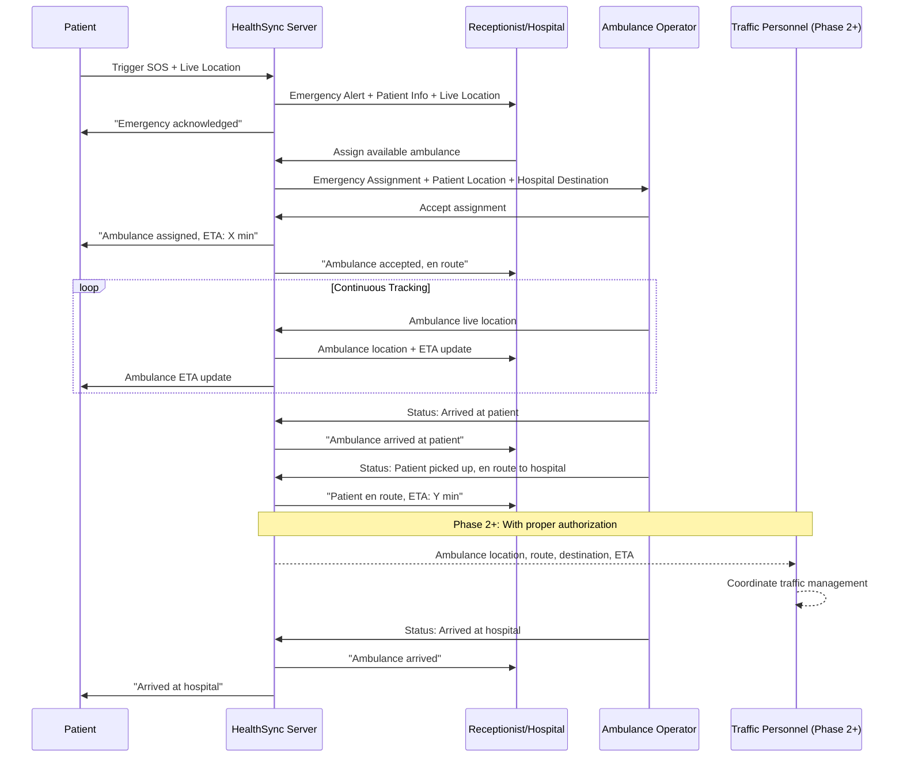

# HealthSync — Product Requirements Document (PRD)

**Version:** 1.0 — Phase 1  
**Date:** 23 August 2026  
**Author:** Product Team  
**Status:** Draft — Awaiting Stakeholder Approval  

---

## 1. Executive Summary

HealthSync is a **full-stack healthcare access, hospital coordination, and emergency response platform** that goes far beyond conventional doctor-booking applications. It connects five stakeholder groups — **Patients, Doctors, Hospital Receptionists, Ambulance Operators, and (future) authorized Traffic-Control Personnel** — into a single, unified ecosystem.

Phase 1 delivers:

| Capability | Scope |
|---|---|
| **Routine Healthcare** | Multilingual patient portal, doctor search, real-time slot availability, appointment lifecycle, digital health records, medicine reminders |
| **Provider Operations** | Doctor dashboard for profile, schedule, availability, consultations, prescriptions |
| **Hospital Operations** | Receptionist dashboard for queues, check-ins, doctor coordination, emergency management |
| **Emergency Response** | Patient SOS trigger → hospital alert → ambulance dispatch → live tracking → (future) traffic coordination |
| **Security & Compliance** | OTP-based auth, RBAC, audit logging, encrypted data at rest and in transit |

### 1.1 Product Vision

> *"Make quality healthcare accessible to every individual — whether they need a routine consultation or a life-saving emergency response — through a single, intuitive, multilingual platform."*

### 1.2 Product Mission

To build a production-grade platform that:

1. Eliminates friction in finding, booking, and managing healthcare appointments.
2. Digitizes health records and medication management for patients.
3. Empowers doctors and hospitals with real-time operational dashboards.
4. Dramatically reduces emergency response times through coordinated SOS, ambulance dispatch, and live tracking.
5. Lays the groundwork for authorized traffic-management integration in subsequent phases.

---

## 2. Problem Statement

### 2.1 Current Pain Points

| Stakeholder | Pain Point |
|---|---|
| **Patients** | Fragmented doctor search across multiple apps; no real-time slot visibility; language barriers (Hindi/Marathi-speaking populations underserved); no unified health record; slow emergency response |
| **Doctors** | Manual schedule management; no centralized view of appointments across clinics/hospitals; paper-based prescriptions |
| **Hospitals / Receptionists** | Manual queue management; no real-time doctor availability; uncoordinated emergency handling |
| **Ambulance Operators** | No digital dispatch; no live patient-location feed; no pre-arrival hospital communication |
| **Traffic Personnel** | No visibility into active ambulance routes; reactive rather than proactive traffic management |

### 2.2 Opportunity

HealthSync addresses these gaps with a **single integrated platform** rather than siloed point solutions. The **Emergency SOS system** is the key differentiator — no existing consumer-facing healthcare app in the target market provides end-to-end emergency coordination from patient alert through ambulance dispatch to (future) traffic management.

---

## 3. Target Users & Personas

### 3.1 Persona 1 — Patient (Primary)

| Attribute | Details |
|---|---|
| **Name** | Meera Patil |
| **Age** | 42 |
| **Location** | Pune, Maharashtra |
| **Tech Literacy** | Low-to-moderate; uses WhatsApp and basic smartphone apps |
| **Language** | Marathi (primary), Hindi |
| **Needs** | Find a nearby cardiologist, book an appointment, get medicine reminders in Marathi, trigger SOS for her elderly mother |
| **Frustrations** | Existing apps are English-only, complex UIs, no emergency features |

### 3.2 Persona 2 — Doctor

| Attribute | Details |
|---|---|
| **Name** | Dr. Rajesh Sharma |
| **Age** | 38 |
| **Specialization** | Orthopedics |
| **Works At** | City Hospital (mornings) + Private Clinic (evenings) |
| **Needs** | Single dashboard to manage schedules across both locations, digital prescriptions, patient consultation history |
| **Frustrations** | Manages schedules manually across two locations; double-bookings happen frequently |

### 3.3 Persona 3 — Receptionist / Hospital Admin

| Attribute | Details |
|---|---|
| **Name** | Anjali Deshmukh |
| **Age** | 29 |
| **Role** | Front-desk receptionist at City Hospital |
| **Needs** | Real-time patient queue, doctor availability board, emergency alerts with patient location, ambulance coordination |
| **Frustrations** | Paper-based check-in; no visibility into which doctors are running late; chaotic emergency intake |

### 3.4 Persona 4 — Ambulance Operator

| Attribute | Details |
|---|---|
| **Name** | Sunil Yadav |
| **Age** | 34 |
| **Role** | Ambulance driver + paramedic |
| **Needs** | Instant emergency assignment, patient's live GPS location, turn-by-turn navigation to patient then hospital, status updates |
| **Frustrations** | Receives calls with vague addresses; no pre-arrival info shared with hospital |

### 3.5 Persona 5 — Traffic Control Personnel (Phase 2+)

| Attribute | Details |
|---|---|
| **Name** | Inspector Kadam |
| **Role** | Traffic control officer |
| **Needs** | Live ambulance location, route, destination, and ETA on a map dashboard |
| **Note** | Phase 2+ — requires government authorization and formal integration agreements |

---

## 4. Feature Requirements — Phase 1

### 4.1 Patient Portal

#### 4.1.1 Onboarding & Authentication

| ID | Feature | Priority | Description |
|---|---|---|---|
| P-001 | Language Selection | P0 | Selection screen at first launch: English, Hindi, Marathi. Language persists across sessions and can be changed in Settings. |
| P-002 | Country Code Selection | P0 | Dropdown with country flags and dial codes. Default: India (+91). |
| P-003 | OTP-based Registration | P0 | Mobile number → OTP verification → create account. No password required. |
| P-004 | OTP-based Login | P0 | Returning users: mobile number → OTP → session token. |
| P-005 | Profile Setup | P0 | Name, age, gender, blood group, emergency contact, address, profile photo (optional). |

#### 4.1.2 Doctor Discovery & Booking

| ID | Feature | Priority | Description |
|---|---|---|---|
| P-010 | Doctor Search | P0 | Search by name, specialization, location, hospital/clinic. |
| P-011 | Doctor Filtering | P0 | Filter by specialization, language spoken, gender, consultation fee range, availability (today/this week), rating. |
| P-012 | Doctor Sorting | P1 | Sort by relevance, rating, fee (low-high / high-low), distance. |
| P-013 | Doctor Profile View | P0 | Photo, name, specialization(s), qualifications, experience, hospital/clinic affiliations, consultation fee, ratings/reviews, languages spoken. |
| P-014 | Real-time Availability | P0 | Show doctor's availability status (available now / next available slot). |
| P-015 | Date-wise Slot View | P0 | Calendar date picker → time slots rendered as **Available** (green), **Booked** (grey/disabled), **Unavailable** (red/disabled — break, off-duty). |
| P-016 | Appointment Booking | P0 | Select available slot → review (doctor, date, time, fee) → confirm. Server-side double-availability check before creation. |
| P-017 | Booking Confirmation | P0 | Confirmation screen with appointment ID, doctor details, date/time, hospital/clinic address. Push + SMS notification. |
| P-018 | Appointment Cancellation | P0 | Cancel upcoming appointment with reason. Cancellation policy displayed. Slot released back to pool. |
| P-019 | Upcoming Appointments | P0 | List of all booked/upcoming appointments with date, time, doctor, location, status. |
| P-020 | Past Appointments | P1 | History of completed/cancelled appointments with consultation notes (if shared by doctor). |

#### 4.1.3 Health Records & Reminders

| ID | Feature | Priority | Description |
|---|---|---|---|
| P-030 | Digital Health Records | P0 | View prescriptions, lab reports, consultation summaries uploaded by doctors. Patients can upload their own documents (PDF, images). |
| P-031 | Medicine Reminders | P1 | Set reminders for medications with name, dosage, frequency, timing. Push notifications at scheduled times. |

#### 4.1.4 Emergency SOS

| ID | Feature | Priority | Description |
|---|---|---|---|
| P-040 | SOS Trigger | P0 | Prominent SOS button → confirmation prompt → triggers emergency flow. |
| P-041 | Live Location Sharing | P0 | On SOS trigger, patient's live GPS location is continuously shared with hospital/receptionist and assigned ambulance. |
| P-042 | Emergency Status View | P0 | Patient sees: emergency acknowledged, ambulance assigned, ambulance en route, ambulance ETA, ambulance arrived. |
| P-043 | Emergency Contact Notification | P1 | Automatic SMS/push to the patient's registered emergency contact on SOS trigger. |

#### 4.1.5 Settings & Preferences

| ID | Feature | Priority | Description |
|---|---|---|---|
| P-050 | Language Change | P0 | Switch between English, Hindi, Marathi at any time. |
| P-051 | Profile Edit | P0 | Update personal details, emergency contact. |
| P-052 | Notification Preferences | P1 | Toggle push, SMS, email notifications. |
| P-053 | Logout | P0 | Secure session termination. |

---

### 4.2 Doctor Dashboard

#### 4.2.1 Authentication & Profile

| ID | Feature | Priority | Description |
|---|---|---|---|
| D-001 | Secure Login | P0 | OTP-based or credential-based login with role verification. |
| D-002 | Profile Management | P0 | Edit name, photo, specializations, qualifications, experience, languages, bio. |
| D-003 | Hospital/Clinic Affiliations | P0 | Add/remove affiliated hospitals and clinics with addresses. |

#### 4.2.2 Schedule & Availability Management

| ID | Feature | Priority | Description |
|---|---|---|---|
| D-010 | Working Hours Setup | P0 | Define working hours per hospital/clinic per day-of-week. Multiple slots per day supported (e.g., 9 AM–1 PM, 4 PM–8 PM). |
| D-011 | Break Management | P0 | Define break periods within working hours. Break slots shown as "Unavailable" to patients. |
| D-012 | Slot Duration Config | P0 | Set consultation duration (e.g., 15 min, 20 min, 30 min) per hospital/clinic. Slots auto-generated from working hours minus breaks. |
| D-013 | Day-off / Leave Management | P1 | Mark specific dates as unavailable. All slots for that date cancelled with patient notifications. |
| D-014 | Real-time Availability Toggle | P0 | Manual override to mark self as available/unavailable immediately. |

#### 4.2.3 Appointment Management

| ID | Feature | Priority | Description |
|---|---|---|---|
| D-020 | Appointment View | P0 | Calendar/list view of all appointments. Filter by date, hospital/clinic, status. |
| D-021 | Appointment Status Updates | P0 | Mark appointments as: Confirmed, In-Progress, Completed, No-Show, Cancelled. |
| D-022 | Patient Info (Appointment Context) | P0 | View patient's name, age, gender, blood group, medical history, reason for visit. |
| D-023 | Consultation Records | P0 | Create consultation notes: symptoms, diagnosis, observations, advice. Linked to appointment. |
| D-024 | Digital Prescriptions | P0 | Create prescriptions: medication name, dosage, frequency, duration, special instructions. Linked to appointment and patient record. |

---

### 4.3 Receptionist / Hospital Dashboard

#### 4.3.1 Authentication & Setup

| ID | Feature | Priority | Description |
|---|---|---|---|
| R-001 | Secure Login | P0 | Credential-based login with receptionist role verification. Linked to specific hospital. |
| R-002 | Hospital Profile | P1 | View/edit hospital details, departments, facilities, contact info. |

#### 4.3.2 Operational Management

| ID | Feature | Priority | Description |
|---|---|---|---|
| R-010 | Appointment Dashboard | P0 | View all appointments across all doctors for the hospital. Filter by doctor, department, date, status. |
| R-011 | Patient Queue Management | P0 | Real-time queue per doctor. Check-in patients → move to "Waiting" → "In Consultation" → "Completed". |
| R-012 | Patient Check-in | P0 | Search patient by name/phone → verify appointment → check in. Walk-in registration supported. |
| R-013 | Doctor Availability Board | P0 | Real-time view of all doctors' current status: Available, In Consultation, On Break, Off Duty, On Leave. |

#### 4.3.3 Emergency Management

| ID | Feature | Priority | Description |
|---|---|---|---|
| R-020 | Emergency Alert Reception | P0 | Real-time alert when patient triggers SOS. Shows patient name, contact, medical info, live location on map. |
| R-021 | Ambulance Assignment | P0 | View available ambulances → assign to emergency → ambulance operator receives notification with patient location. |
| R-022 | Emergency Patient Location | P0 | Live map view of emergency patient's GPS location with continuous updates. |
| R-023 | Ambulance Tracking | P0 | Live map view of assigned ambulance's location, route, and ETA. |
| R-024 | Emergency Status Updates | P0 | Track emergency lifecycle: Alert Received → Ambulance Assigned → Ambulance En Route → Patient Picked Up → En Route to Hospital → Arrived. |
| R-025 | Hospital Communication | P1 | In-app messaging/alerts to prepare ER team with patient info before ambulance arrival. |

---

### 4.4 Ambulance Operator Interface

#### 4.4.1 Authentication & Management

| ID | Feature | Priority | Description |
|---|---|---|---|
| A-001 | Secure Login | P0 | OTP/credential-based login with ambulance-operator role verification. |
| A-002 | Availability Status | P0 | Toggle: Available / Unavailable / On Assignment. |

#### 4.4.2 Emergency Assignment & Navigation

| ID | Feature | Priority | Description |
|---|---|---|---|
| A-010 | Emergency Assignment Notification | P0 | Push notification with patient details, location, and hospital destination. Accept/reject assignment. |
| A-011 | Patient Live Location | P0 | Map view with patient's live GPS pin. Auto-updates. |
| A-012 | Navigation to Patient | P0 | Turn-by-turn navigation from current location to patient's location. Integration with device maps. |
| A-013 | Hospital Destination | P0 | After patient pickup, navigation switches to assigned hospital destination. |
| A-014 | Live Ambulance Tracking | P0 | Ambulance's location continuously shared with hospital/receptionist dashboard. |
| A-015 | Emergency Status Updates | P0 | Update status: En Route to Patient → Arrived at Patient → Patient Picked Up → En Route to Hospital → Arrived at Hospital. |
| A-016 | Hospital Communication | P1 | Quick-message/alert to hospital with patient condition updates during transit. |

---

### 4.5 Emergency SOS — End-to-End Flow

This is HealthSync's **primary differentiator**. The complete flow:



---

### 4.6 Traffic Control Integration (Phase 2+)

> [!IMPORTANT]
> This feature is **explicitly scoped for Phase 2+** and requires:
> - Formal government authorization and MoU
> - Integration with official traffic-management systems
> - Compliance with data-sharing regulations
> - Security and privacy audits

| ID | Feature | Priority | Description |
|---|---|---|---|
| T-001 | Ambulance Location Dashboard | Phase 2 | Map view of all active emergency ambulances with location, route, destination, ETA. |
| T-002 | Route & ETA Alerts | Phase 2 | Automated alerts to traffic personnel along the ambulance's route. |
| T-003 | Traffic Signal Coordination | Phase 3 | Subject to IoT integration — automated or semi-automated signal management. |

---

## 5. User Experience Requirements

### 5.1 Design Principles

| Principle | Explanation |
|---|---|
| **Simplicity First** | Designed for users with low-to-moderate tech literacy (Persona 1). Large touch targets, minimal text input, visual cues. |
| **Mobile First** | Primary interface is mobile. Desktop dashboards for doctors, receptionists, and hospital admins. |
| **Multilingual Native** | Not an afterthought — all UI text, labels, notifications, and system messages available in English, Hindi, and Marathi. |
| **Accessibility** | WCAG 2.1 AA compliance. High contrast, screen reader support, scalable fonts. |
| **Progressive Disclosure** | Show only what's needed at each step. Advanced features discoverable but not overwhelming. |

### 5.2 Key User Flows

#### Flow 1: Patient Books an Appointment

```
Language Selection → Registration/Login (OTP) → Home Screen → Search Doctor
→ Filter/Sort Results → View Doctor Profile → Select Date → View Available Slots
→ Select Slot → Review & Confirm → Booking Confirmation Screen + Notification
```

#### Flow 2: Doctor Manages Schedule

```
Login → Dashboard Home → Schedule Management → Set Working Hours per Location
→ Set Breaks → Set Slot Duration → View Generated Slots → Manage Leave
→ View Appointments → Start Consultation → Create Notes + Prescription → Complete
```

#### Flow 3: Patient Triggers Emergency SOS

```
SOS Button (any screen) → Confirmation Dialog → Location Permission
→ Emergency Submitted → Status Updates (Acknowledged → Ambulance Assigned
→ Ambulance En Route → Ambulance Arrived → En Route to Hospital → Arrived)
```

#### Flow 4: Receptionist Handles Emergency

```
Alert Notification → View Patient Info + Live Location on Map
→ View Available Ambulances → Assign Ambulance → Track Ambulance Live
→ Prepare ER Team → Patient Arrival → Check-in
```

#### Flow 5: Ambulance Operator Responds

```
Assignment Notification → View Patient Location + Hospital Destination
→ Accept Assignment → Navigate to Patient → Update: Arrived
→ Update: Patient Picked Up → Navigate to Hospital → Update: Arrived at Hospital
```

---

## 6. Non-Functional Requirements

| Category | Requirement |
|---|---|
| **Performance** | Page load < 2s; API response < 500ms (p95); real-time location updates ≤ 3s latency |
| **Scalability** | Support 10,000 concurrent users in Phase 1; horizontally scalable architecture |
| **Availability** | 99.9% uptime SLA; emergency services: 99.99% |
| **Security** | HTTPS/TLS everywhere; OTP via secure SMS gateway; JWT/session tokens with expiry; RBAC; input validation; SQL injection / XSS prevention |
| **Privacy** | Patient data encrypted at rest (AES-256); HIPAA-aligned practices; minimal data collection; user consent for location sharing |
| **Audit** | All data access and modifications logged with user ID, timestamp, action, and IP |
| **Localization** | Full i18n support for EN, HI, MR; RTL-ready architecture for future languages |
| **Mobile Responsiveness** | Works on screens ≥ 320px width; touch-friendly; tested on Android (Chrome) and iOS (Safari) |

---

## 7. Success Metrics — Phase 1

| Metric | Target |
|---|---|
| Patient registration → first booking conversion | ≥ 40% |
| Appointment booking success rate (no double-bookings) | 100% |
| Average time from SOS trigger to ambulance assignment | < 2 minutes |
| Average time from SOS trigger to ambulance arrival (urban) | < 10 minutes |
| System uptime | ≥ 99.9% |
| Patient satisfaction (post-appointment survey) | ≥ 4.2 / 5.0 |
| Doctor dashboard daily active usage | ≥ 70% of registered doctors |
| Receptionist queue management adoption | ≥ 80% of partner hospitals |

---

## 8. Assumptions & Constraints

### 8.1 Assumptions

1. Users have smartphones with GPS and internet connectivity.
2. SMS gateway available for OTP delivery across India.
3. Hospitals and doctors onboarded through partnerships (B2B sales).
4. Ambulance operators have dedicated Android devices with GPS.
5. Government authorization for traffic integration will be pursued in parallel for Phase 2.

### 8.2 Constraints

1. Phase 1 geographic scope: select cities in Maharashtra (Pune, Mumbai, Nagpur).
2. Traffic-control integration is **out of scope** for Phase 1.
3. Payment processing (consultation fees) is **out of scope** for Phase 1 — to be added in Phase 2.
4. Video consultation/telemedicine is **out of scope** for Phase 1.

---

## 9. Risks & Mitigations

| Risk | Impact | Probability | Mitigation |
|---|---|---|---|
| Low patient adoption due to digital literacy gaps | High | Medium | Simplified UI, multilingual support, onboarding tutorials, offline SMS fallback for critical notifications |
| Doctor/hospital onboarding resistance | High | Medium | Free trial period, dedicated onboarding support, demonstrate ROI through queue management efficiency |
| GPS accuracy issues in dense urban areas | Medium | Medium | Use Wi-Fi + cell tower triangulation fallback; allow manual location entry |
| SMS OTP delivery delays | High | Low | Multiple SMS provider failover; WhatsApp OTP as backup channel |
| Emergency system abuse (false SOS triggers) | Medium | Medium | Confirmation dialog; rate limiting; post-incident review; user warnings/bans |
| Data breach / privacy violation | Critical | Low | Encryption, RBAC, audit logging, penetration testing, security reviews |

---

## 10. Release Plan

| Phase | Timeline | Scope |
|---|---|---|
| **Phase 1.0 — MVP** | Month 1–4 | Patient portal (search, book, cancel), Doctor dashboard (schedule, appointments), Receptionist dashboard (queue, check-in), Core database & auth |
| **Phase 1.1 — Emergency** | Month 4–6 | SOS system, ambulance operator interface, live tracking, emergency coordination |
| **Phase 1.2 — Health Records** | Month 5–7 | Digital prescriptions, health records, medicine reminders |
| **Phase 2.0 — Expansion** | Month 8–12 | Payment integration, traffic-control integration (subject to authorization), video consultation, analytics dashboards, additional languages |

---

## 11. Stakeholder Sign-off

| Role | Name | Signature | Date |
|---|---|---|---|
| Product Owner | | | |
| Engineering Lead | | | |
| Design Lead | | | |
| Medical Advisor | | | |
| Legal / Compliance | | | |

---

*This document is a living artifact and will be updated as requirements evolve through stakeholder feedback and development iterations.*
