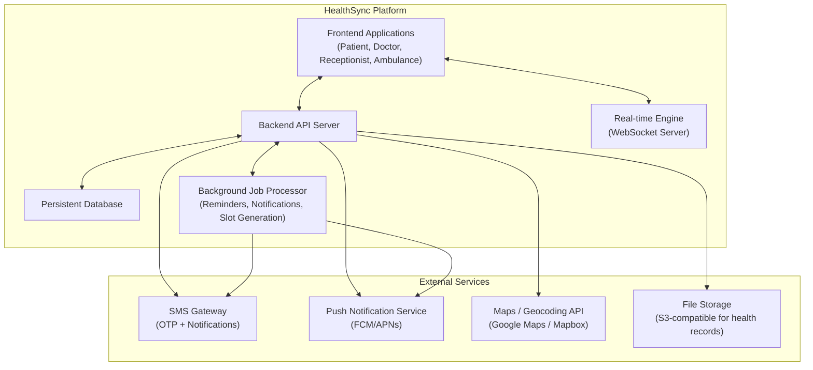
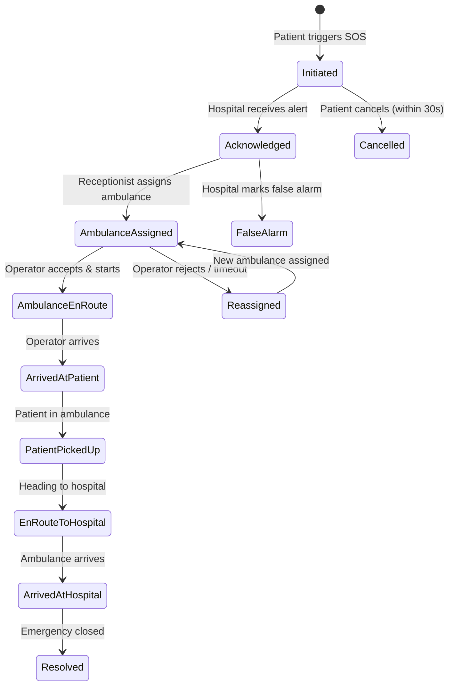
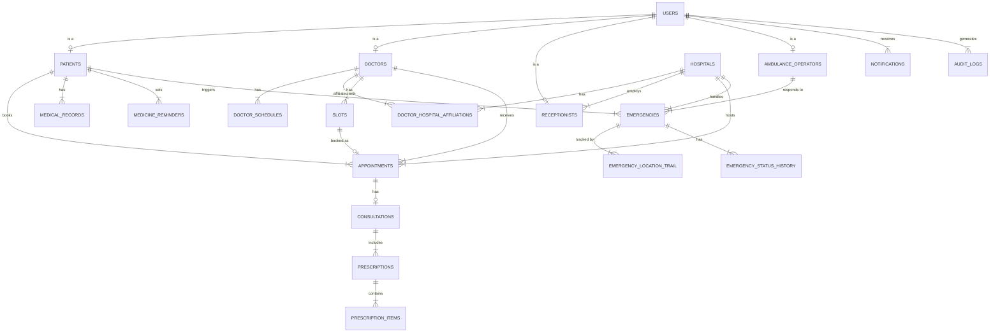
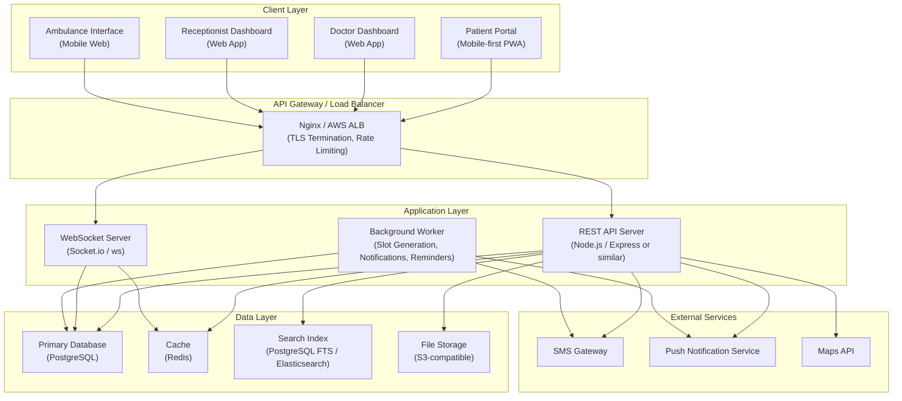
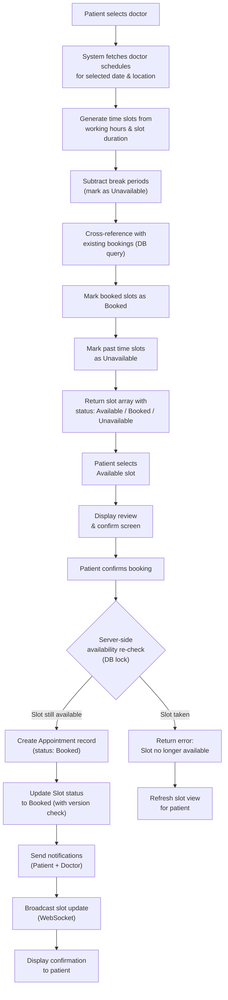
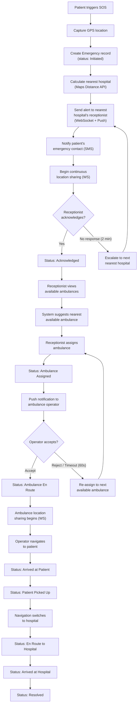

# HealthSync — Software Requirements Specification (SRS)

**Version:** 1.0 — Phase 1  
**Date:** 23 August 2026  
**Prepared by:** Engineering Team  
**Reference:** HealthSync PRD v1.0  
**Standard:** IEEE 830-1998 (adapted)  
**Status:** Draft  

---

## Table of Contents

1. [Introduction](#1-introduction)
2. [Overall Description](#2-overall-description)
3. [Functional Requirements](#3-functional-requirements)
4. [External Interface Requirements](#4-external-interface-requirements)
5. [Non-Functional Requirements](#5-non-functional-requirements)
6. [Database Design](#6-database-design)
7. [API Specifications](#7-api-specifications)
8. [System Architecture](#8-system-architecture)
9. [Data Flow Diagrams](#9-data-flow-diagrams)
10. [Traceability Matrix](#10-traceability-matrix)
11. [Appendices](#11-appendices)

---

## 1. Introduction

### 1.1 Purpose

This Software Requirements Specification (SRS) document describes the complete functional and non-functional requirements for **HealthSync Phase 1** — a healthcare access, hospital coordination, and emergency response platform. It is intended for the development team, QA engineers, architects, and stakeholders for implementation, testing, and validation.

### 1.2 Scope

HealthSync Phase 1 encompasses:

- **Patient Portal** — Multilingual (EN/HI/MR) mobile-first web application for doctor discovery, appointment booking, health records, medicine reminders, and Emergency SOS.
- **Doctor Dashboard** — Web application for schedule management, appointment handling, consultations, and digital prescriptions.
- **Receptionist / Hospital Dashboard** — Web application for queue management, patient check-in, doctor availability, and emergency coordination.
- **Ambulance Operator Interface** — Mobile-optimized web application for emergency dispatch, patient location, navigation, and status updates.
- **Emergency SOS System** — Real-time emergency coordination connecting patients, hospitals, and ambulances with live GPS tracking.
- **Backend System** — RESTful API server, persistent relational database, real-time communication (WebSockets), authentication/authorization, and audit logging.

**Out of Scope for Phase 1:**
- Payment / billing integration
- Video consultation / telemedicine
- Traffic-control system integration (planned Phase 2+)
- Native mobile applications (iOS / Android)

### 1.3 Definitions, Acronyms & Abbreviations

| Term | Definition |
|---|---|
| **OTP** | One-Time Password — a time-limited code sent via SMS for authentication |
| **RBAC** | Role-Based Access Control — authorization model where permissions are assigned to roles |
| **SOS** | Emergency alert system triggered by the patient |
| **ETA** | Estimated Time of Arrival |
| **JWT** | JSON Web Token — standard for securely transmitting information between parties |
| **CRUD** | Create, Read, Update, Delete — basic data operations |
| **i18n** | Internationalization — design pattern enabling multi-language support |
| **WebSocket** | Full-duplex communication protocol for real-time data exchange |
| **GPS** | Global Positioning System — satellite-based location service |
| **HIPAA** | Health Insurance Portability and Accountability Act — US healthcare data privacy standard (used as best-practice reference) |
| **ER** | Emergency Room |
| **API** | Application Programming Interface |
| **p95** | 95th percentile — used for performance benchmarks |

### 1.4 References

1. HealthSync PRD v1.0 (23 August 2026)
2. IEEE 830-1998 — Recommended Practice for Software Requirements Specifications
3. OWASP Top 10 — Web Application Security Risks
4. WCAG 2.1 — Web Content Accessibility Guidelines

### 1.5 Overview

The remainder of this document is organized as follows: Section 2 provides an overall system description; Section 3 details all functional requirements; Section 4 specifies external interfaces; Section 5 covers non-functional requirements; Section 6 describes database design; Section 7 outlines API specifications; Section 8 presents system architecture; Section 9 contains data flow diagrams; Section 10 provides a traceability matrix.

---

## 2. Overall Description

### 2.1 Product Perspective

HealthSync is a **new, self-contained system** that integrates with the following external services:



### 2.2 Product Functions (Summary)

| Module | Functions |
|---|---|
| Patient Portal | Registration, Login, Profile, Doctor Search, Appointment Booking/Cancellation, Health Records, Medicine Reminders, Emergency SOS, Settings |
| Doctor Dashboard | Login, Profile Management, Schedule/Availability Management, Appointment Management, Consultation Notes, Prescriptions |
| Receptionist Dashboard | Login, Appointment Overview, Patient Queue, Check-in, Doctor Availability Board, Emergency Alert Handling, Ambulance Assignment/Tracking |
| Ambulance Interface | Login, Availability Status, Emergency Assignment, Patient Location, Navigation, Status Updates, Hospital Communication |
| Emergency SOS | Patient trigger, Hospital alert, Ambulance dispatch, Live tracking, Status lifecycle |

### 2.3 User Characteristics

| User Class | Characteristics | Technical Proficiency |
|---|---|---|
| **Patient** | General public, ages 18–80, diverse educational backgrounds, may prefer regional languages | Low to Moderate |
| **Doctor** | Medical professionals, comfortable with digital tools, time-constrained | Moderate to High |
| **Receptionist** | Hospital staff, routine computer users, shift-based work | Moderate |
| **Ambulance Operator** | Field operators, primarily mobile-device users, need one-hand operation during driving | Low to Moderate |
| **System Administrator** | IT staff managing the platform | High |

### 2.4 Constraints

1. **Regulatory**: Must comply with Indian IT Act 2000, data protection norms, and healthcare data handling best practices.
2. **Technology**: Must run on modern browsers (Chrome 90+, Safari 14+, Firefox 88+, Edge 90+).
3. **Network**: Must handle intermittent connectivity gracefully, especially for ambulance operators in transit.
4. **Hardware**: Patient app must work on devices with ≥ 2GB RAM and Android 8.0+ or iOS 14+.
5. **Localization**: All user-facing text must support English, Hindi (Devanagari), and Marathi (Devanagari).

### 2.5 Assumptions & Dependencies

1. Reliable SMS gateway with ≥ 99.5% delivery rate.
2. Users grant GPS/location permissions when required.
3. Maps API (Google Maps or Mapbox) available with adequate quota.
4. Cloud hosting provider with multi-AZ support.
5. Hospital data (doctors, departments, facilities) onboarded through admin interface or bulk import.

---

## 3. Functional Requirements

### 3.1 Module: Patient Portal

---

#### FR-P-001: Language Selection

| Attribute | Value |
|---|---|
| **ID** | FR-P-001 |
| **Priority** | P0 (Must Have) |
| **Source** | PRD P-001 |

**Description:** The system shall display a language selection screen on first application access, offering three options: English, Hindi, Marathi.

**Inputs:** User selection (tap/click on language option).

**Processing:**
1. On first access, the system SHALL display a language selection modal/screen before any other content.
2. The system SHALL store the selected language preference in local storage and user profile (if authenticated).
3. All UI elements, labels, buttons, form placeholders, system messages, error messages, and notifications SHALL be rendered in the selected language.

**Outputs:** Application renders in the selected language. Preference is persisted.

**Acceptance Criteria:**
- [ ] Language selection screen appears on first visit.
- [ ] Selecting a language immediately changes all visible UI text.
- [ ] Language preference persists across sessions (browser refresh, re-login).
- [ ] Language can be changed later via Settings (see FR-P-025).

---

#### FR-P-002: Country Code Selection

| Attribute | Value |
|---|---|
| **ID** | FR-P-002 |
| **Priority** | P0 (Must Have) |
| **Source** | PRD P-002 |

**Description:** The registration/login screen shall include a country code selector with country flags and dial codes.

**Inputs:** User interaction with dropdown.

**Processing:**
1. The system SHALL display a searchable dropdown of countries with: flag icon, country name, and dial code.
2. Default selection SHALL be India (+91).
3. The selected country code SHALL be prepended to the entered phone number for OTP delivery.

**Outputs:** Selected country code stored with phone number.

**Acceptance Criteria:**
- [ ] Dropdown displays country flags and codes.
- [ ] India (+91) is the default selection.
- [ ] Dropdown is searchable by country name.
- [ ] At least 20 major countries are included.

---

#### FR-P-003: OTP-Based Registration

| Attribute | Value |
|---|---|
| **ID** | FR-P-003 |
| **Priority** | P0 (Must Have) |
| **Source** | PRD P-003 |

**Description:** New users shall register using their mobile number with OTP verification.

**Inputs:** Country code, mobile number.

**Processing:**
1. User enters mobile number with country code.
2. System validates format: 10 digits for India, appropriate lengths for other countries.
3. System checks if the number is already registered.
   - If registered → redirect to login flow.
   - If not registered → proceed.
4. System generates a 6-digit OTP, valid for 5 minutes.
5. System sends OTP via SMS gateway.
6. User enters OTP.
7. System validates OTP.
   - If valid → create user account with role "Patient", generate session token, redirect to Profile Setup.
   - If invalid → display error, allow retry (max 3 attempts).
   - If expired → allow "Resend OTP" (max 3 resends within 15 minutes).
8. Rate limiting: max 5 OTP requests per phone number per hour.

**Outputs:** New user account created; session token issued; redirect to profile setup.

**Error Handling:**
- Invalid phone format → inline validation error.
- SMS delivery failure → retry with backup provider; show "OTP not received? Resend" option.
- Max attempts exceeded → lock for 30 minutes with message.

**Acceptance Criteria:**
- [ ] 6-digit OTP is sent to the entered mobile number.
- [ ] OTP expires after 5 minutes.
- [ ] Maximum 3 entry attempts before temporary lockout.
- [ ] Resend OTP available with cooldown (30 seconds between resends).
- [ ] Duplicate phone number detection redirects to login.
- [ ] Successful OTP verification creates account and issues session.

---

#### FR-P-004: OTP-Based Login

| Attribute | Value |
|---|---|
| **ID** | FR-P-004 |
| **Priority** | P0 (Must Have) |
| **Source** | PRD P-004 |

**Description:** Returning users shall log in using mobile number and OTP verification.

**Inputs:** Country code, mobile number.

**Processing:**
1. User enters mobile number.
2. System validates the number exists in the database.
   - If not found → redirect to registration flow.
   - If found → proceed.
3. System generates and sends OTP (same rules as FR-P-003).
4. On successful verification → issue JWT/session token with user role and expiry (24 hours, configurable).
5. System SHALL support "Remember Me" to extend session to 30 days.

**Outputs:** Session token issued; user redirected to home/dashboard.

**Acceptance Criteria:**
- [ ] Unregistered number redirects to registration.
- [ ] Successful OTP validates and creates session.
- [ ] Session token expires after 24 hours (default) or 30 days (Remember Me).
- [ ] Multiple concurrent sessions supported (phone + tablet).

---

#### FR-P-005: Patient Profile Setup

| Attribute | Value |
|---|---|
| **ID** | FR-P-005 |
| **Priority** | P0 (Must Have) |
| **Source** | PRD P-005 |

**Description:** After registration, the system shall prompt the user to complete their profile.

**Required Fields:**
- Full name (text, 2–100 characters)
- Date of birth (date picker, age auto-calculated)
- Gender (Male / Female / Other / Prefer not to say)
- Blood group (dropdown: A+, A−, B+, B−, AB+, AB−, O+, O−, Unknown)

**Optional Fields:**
- Emergency contact (name + phone number)
- Address (line 1, line 2, city, state, pin code)
- Profile photo (JPEG/PNG, max 5 MB)
- Known allergies (free text)
- Existing conditions (multi-select from common list + free text)

**Processing:**
1. System SHALL validate all inputs before submission.
2. Profile photo SHALL be resized to max 500×500 px and stored in file storage.
3. Profile data SHALL be stored in the `patients` table linked to the `users` table.

**Acceptance Criteria:**
- [ ] All required fields must be filled to proceed.
- [ ] Date of birth calculates and displays age.
- [ ] Profile photo upload works with preview.
- [ ] Profile can be edited later (FR-P-026).

---

#### FR-P-006: Doctor Search

| Attribute | Value |
|---|---|
| **ID** | FR-P-006 |
| **Priority** | P0 (Must Have) |
| **Source** | PRD P-010 |

**Description:** Patients shall be able to search for doctors by various criteria.

**Inputs:** Search query (text), filters (see FR-P-007).

**Processing:**
1. System SHALL support search by:
   - Doctor name (partial match, case-insensitive)
   - Specialization (from predefined list)
   - Hospital/clinic name
   - Location / city / area
2. Search results SHALL display:
   - Doctor photo, name, specialization(s), experience (years), consultation fee, rating (average), hospital/clinic name(s), next available slot.
3. Results SHALL be paginated (20 per page).
4. Search SHALL support debounced autocomplete (300ms delay).

**Outputs:** Paginated list of matching doctors.

**Acceptance Criteria:**
- [ ] Partial name search returns relevant results.
- [ ] Specialization search shows all doctors of that specialty.
- [ ] Results include next available slot information.
- [ ] Empty search shows recommended/nearby doctors.
- [ ] Results paginate correctly.

---

#### FR-P-007: Doctor Filtering & Sorting

| Attribute | Value |
|---|---|
| **ID** | FR-P-007 |
| **Priority** | P0 (Must Have) |
| **Source** | PRD P-011, P-012 |

**Description:** Search results shall be filterable and sortable.

**Filter Options:**
| Filter | Type | Values |
|---|---|---|
| Specialization | Multi-select | Cardiologist, Dermatologist, Orthopedist, Pediatrician, General Physician, etc. |
| Language Spoken | Multi-select | English, Hindi, Marathi, etc. |
| Gender | Single-select | Male, Female, Any |
| Consultation Fee | Range slider | ₹0 – ₹5000 |
| Availability | Single-select | Available Today, This Week, Any |
| Rating | Minimum slider | 1.0 – 5.0 |

**Sort Options:**
| Sort | Order |
|---|---|
| Relevance | Default |
| Rating | High to Low |
| Fee | Low to High / High to Low |
| Experience | High to Low |
| Distance | Near to Far (requires location permission) |

**Acceptance Criteria:**
- [ ] Multiple filters can be applied simultaneously.
- [ ] Filters update results in real-time (no page reload).
- [ ] Active filters are clearly indicated and individually removable.
- [ ] Sort selection immediately reorders results.

---

#### FR-P-008: Doctor Profile View

| Attribute | Value |
|---|---|
| **ID** | FR-P-008 |
| **Priority** | P0 (Must Have) |
| **Source** | PRD P-013 |

**Description:** Clicking on a doctor in search results SHALL display a detailed profile.

**Profile Sections:**
1. **Header**: Photo, name, primary specialization, verification badge.
2. **About**: Full bio, qualifications, years of experience, registration number.
3. **Specializations**: List of all specializations.
4. **Affiliations**: Hospitals and clinics with addresses and maps.
5. **Fee**: Consultation fee per location.
6. **Languages**: Spoken languages.
7. **Ratings & Reviews**: Average rating, total reviews, individual reviews (paginated).
8. **Availability**: Quick view of next 7 days with available slot counts.
9. **Book Appointment CTA**: Prominent button to proceed to slot selection.

**Acceptance Criteria:**
- [ ] All profile sections render correctly with data.
- [ ] Map shows clinic/hospital locations.
- [ ] "Book Appointment" button is visible and navigates to slot view.
- [ ] Reviews are paginated and sortable (newest, highest, lowest).

---

#### FR-P-009: Real-time Doctor Availability

| Attribute | Value |
|---|---|
| **ID** | FR-P-009 |
| **Priority** | P0 (Must Have) |
| **Source** | PRD P-014 |

**Description:** The system SHALL show real-time availability status on doctor cards and profiles.

**Processing:**
1. System SHALL compute availability based on:
   - Doctor's working hours for today.
   - Current time relative to working hours.
   - Whether the doctor has manually toggled "Unavailable".
   - Number of remaining open slots today.
2. Status values: **Available Now** (has open slots today), **Next Available: [Date/Time]**, **Unavailable**.
3. Status SHALL update via WebSocket when the doctor's availability changes.

**Acceptance Criteria:**
- [ ] Doctor cards in search results show current availability status.
- [ ] Status updates in real-time without page refresh.
- [ ] "Available Now" shows only if there are bookable slots remaining today.

---

#### FR-P-010: Date-wise Appointment Slot View

| Attribute | Value |
|---|---|
| **ID** | FR-P-010 |
| **Priority** | P0 (Must Have) |
| **Source** | PRD P-015 |

**Description:** When a patient selects a doctor for booking, the system SHALL display a calendar with date-wise slot availability.

**Inputs:** Doctor ID, selected date.

**Processing:**
1. System SHALL show a date picker allowing selection from today up to 30 days in the future.
2. For the selected date, system SHALL compute slots by:
   a. Retrieve doctor's working hours for that day-of-week at the selected location.
   b. Generate time slots based on configured slot duration (e.g., every 15 min).
   c. Subtract break periods → mark as **Unavailable**.
   d. Cross-reference with existing bookings → mark as **Booked**.
   e. Remaining slots → mark as **Available**.
3. Slot display:
   - **Available** (green) — patient can select.
   - **Booked** (grey, disabled) — already taken.
   - **Unavailable** (red, disabled) — break, off-duty, leave, past time.
4. Dates with 0 available slots SHALL be visually indicated on the calendar (greyed out).

**Outputs:** Grid/list of time slots with status indicators.

**Acceptance Criteria:**
- [ ] Calendar date picker shows 30 days from today.
- [ ] Slots render with correct color coding: green (available), grey (booked), red (unavailable).
- [ ] Past time slots (today) are marked unavailable.
- [ ] Dates with no availability are visually indicated.
- [ ] Slot data refreshes when switching dates.
- [ ] Slots update in near-real-time if another patient books while viewing.

---

#### FR-P-011: Appointment Booking

| Attribute | Value |
|---|---|
| **ID** | FR-P-011 |
| **Priority** | P0 (Must Have) |
| **Source** | PRD P-016 |

**Description:** Patient selects an available slot and confirms the booking.

**Inputs:** Doctor ID, date, time slot, location (hospital/clinic), optional: reason for visit (text, max 500 chars).

**Processing:**
1. Patient taps an **Available** slot.
2. System shows a **Review & Confirm** screen:
   - Doctor name and photo
   - Specialization
   - Date and time
   - Hospital/clinic name and address
   - Consultation fee
   - Reason for visit (optional text input)
3. Patient taps "Confirm Booking".
4. **Server-side validation** (critical):
   a. Re-check that the slot is still available at the time of request (prevent race conditions).
   b. If still available → create appointment with status "Booked".
   c. If no longer available → return error "Slot no longer available" → refresh slot view.
5. On successful booking:
   a. Create appointment record in database.
   b. Send confirmation notification (push + SMS) to patient.
   c. Send notification to doctor.
   d. Update slot status to "Booked" across all connected clients (WebSocket).

**Outputs:** Appointment record created; notifications sent; confirmation screen displayed.

**Concurrency Control:**
- Use database-level locking or optimistic concurrency (version/timestamp) to prevent double-booking.
- The first confirmed request wins; subsequent requests for the same slot receive an error.

**Acceptance Criteria:**
- [ ] Review screen shows all appointment details.
- [ ] Server-side availability check prevents double-booking.
- [ ] Successful booking creates a database record with status "Booked".
- [ ] Patient and doctor receive notifications.
- [ ] Slot status updates in real-time for other patients viewing the same doctor.
- [ ] Concurrent booking attempts handled correctly — only one succeeds.

---

#### FR-P-012: Appointment Confirmation Display

| Attribute | Value |
|---|---|
| **ID** | FR-P-012 |
| **Priority** | P0 (Must Have) |
| **Source** | PRD P-017 |

**Description:** After successful booking, the system SHALL display a confirmation screen.

**Display Fields:**
- Appointment ID (system-generated, human-readable, e.g., HS-APT-20260823-0042)
- Doctor name, photo, specialization
- Date and time
- Hospital/clinic name and address
- Consultation fee
- Status: "Confirmed"
- Option to add to device calendar
- Option to share appointment details

**Acceptance Criteria:**
- [ ] Confirmation screen displays all relevant details.
- [ ] Appointment ID is unique and human-readable.
- [ ] "Add to Calendar" generates a calendar event.
- [ ] SMS confirmation is sent with appointment ID and details.

---

#### FR-P-013: Appointment Cancellation

| Attribute | Value |
|---|---|
| **ID** | FR-P-013 |
| **Priority** | P0 (Must Have) |
| **Source** | PRD P-018 |

**Description:** Patients shall be able to cancel upcoming appointments.

**Inputs:** Appointment ID, cancellation reason (dropdown + optional free text).

**Processing:**
1. Patient navigates to Upcoming Appointments → selects appointment → taps "Cancel".
2. System displays cancellation policy (e.g., free cancellation up to 2 hours before appointment).
3. Patient selects reason from dropdown: Plans Changed, Found Another Doctor, Feeling Better, Emergency, Other.
4. Patient confirms cancellation.
5. System updates appointment status to "Cancelled by Patient".
6. System releases the slot back to the available pool.
7. Notifications sent to patient (confirmation) and doctor (alert).

**Acceptance Criteria:**
- [ ] Cancellation option available for upcoming appointments only.
- [ ] Cancellation policy displayed before confirmation.
- [ ] Cancelled slot becomes available for other patients.
- [ ] Both patient and doctor notified.
- [ ] Cancellation reason stored for analytics.

---

#### FR-P-014: Upcoming Appointments List

| Attribute | Value |
|---|---|
| **ID** | FR-P-014 |
| **Priority** | P0 (Must Have) |
| **Source** | PRD P-019 |

**Description:** Patients shall view a list of all upcoming/booked appointments.

**Display per Appointment:**
- Date and time
- Doctor name and specialization
- Hospital/clinic name
- Status (Booked, Confirmed, In-Progress)
- Time remaining (countdown)
- Actions: View Details, Cancel, Reschedule (Phase 2)

**Sorting:** Chronological (soonest first).

**Acceptance Criteria:**
- [ ] All future appointments with status Booked/Confirmed are listed.
- [ ] Appointments are sorted chronologically.
- [ ] Each appointment card shows key details.
- [ ] Tapping an appointment shows full details.
- [ ] List updates in real-time when doctor changes appointment status.

---

#### FR-P-015: Past Appointments History

| Attribute | Value |
|---|---|
| **ID** | FR-P-015 |
| **Priority** | P1 (Should Have) |
| **Source** | PRD P-020 |

**Description:** Patients shall view a history of completed and cancelled appointments.

**Display per Appointment:**
- Date and time
- Doctor name and specialization
- Status (Completed, Cancelled, No-Show)
- Consultation notes (if shared by doctor)
- Prescription (if issued)
- Option to "Book Again" with the same doctor

**Acceptance Criteria:**
- [ ] All past appointments listed in reverse chronological order.
- [ ] Consultation notes and prescriptions visible if shared.
- [ ] "Book Again" navigates to the doctor's slot view.

---

#### FR-P-016: Digital Health Records

| Attribute | Value |
|---|---|
| **ID** | FR-P-016 |
| **Priority** | P0 (Must Have) |
| **Source** | PRD P-030 |

**Description:** Patients shall have access to a digital health records section.

**Features:**
1. **Doctor-uploaded records:**
   - Prescriptions (linked to appointments)
   - Consultation summaries
   - Lab reports (uploaded by doctor/hospital)
2. **Self-uploaded records:**
   - Patients can upload documents (PDF, JPEG, PNG; max 10 MB per file; max 100 files total).
   - Categorization: Prescription, Lab Report, Scan/X-Ray, Insurance, Other.
   - Metadata: date, doctor name (optional), notes (optional).
3. **View & download**: All records viewable in-app and downloadable.
4. **Chronological timeline view** of all health records.

**Acceptance Criteria:**
- [ ] Doctor prescriptions appear automatically after consultation.
- [ ] Patient can upload PDF, JPEG, PNG files (max 10 MB each).
- [ ] Records are categorized and searchable.
- [ ] Timeline view shows all records chronologically.
- [ ] Records are accessible only by the patient and authorized doctors during consultations.

---

#### FR-P-017: Medicine Reminders

| Attribute | Value |
|---|---|
| **ID** | FR-P-017 |
| **Priority** | P1 (Should Have) |
| **Source** | PRD P-031 |

**Description:** Patients shall set medication reminders.

**Inputs:** Medicine name, dosage, frequency (daily, twice daily, etc.), specific times, start date, end date (optional), instructions (before/after food).

**Processing:**
1. System stores reminder configuration.
2. Background job scheduler triggers push notifications at specified times.
3. Patient can mark "Taken" or "Skipped" for each reminder.
4. Adherence tracking: percentage of "Taken" vs scheduled.

**Outputs:** Push notifications at scheduled times; adherence history.

**Acceptance Criteria:**
- [ ] Reminder creation with medicine name, dosage, times.
- [ ] Push notification fires at scheduled time.
- [ ] Patient can mark taken/skipped.
- [ ] Adherence percentage displayed.
- [ ] Reminders editable and deletable.

---

#### FR-P-018: Emergency SOS Trigger

| Attribute | Value |
|---|---|
| **ID** | FR-P-018 |
| **Priority** | P0 (Must Have) |
| **Source** | PRD P-040 |

**Description:** Patients shall be able to trigger an emergency SOS from any screen.

**Inputs:** SOS button tap, GPS location, patient profile data.

**Processing:**
1. SOS button SHALL be accessible from any screen (floating action button or persistent navigation element).
2. On tap, system shows a confirmation dialog: "Are you sure you want to trigger an Emergency SOS?" with 5-second countdown auto-cancel.
3. On confirmation:
   a. Request GPS location permission (if not already granted).
   b. Capture current GPS coordinates.
   c. Create emergency record in database with status "Initiated".
   d. Send emergency alert to nearest hospital/receptionist dashboard with:
      - Patient name, age, gender, blood group
      - Known allergies and conditions
      - Emergency contact info
      - Live GPS location
   e. Begin continuous location sharing (every 5 seconds).
   f. Send SMS to patient's emergency contact (if configured).
4. Display emergency status screen to patient (see FR-P-019).

**Acceptance Criteria:**
- [ ] SOS button visible on all screens.
- [ ] Confirmation dialog prevents accidental triggers.
- [ ] Location permission requested if not granted.
- [ ] Emergency record created in database.
- [ ] Hospital/receptionist receives real-time alert.
- [ ] Patient's live location shared continuously.
- [ ] Emergency contact notified via SMS.

---

#### FR-P-019: Emergency Status Tracking (Patient View)

| Attribute | Value |
|---|---|
| **ID** | FR-P-019 |
| **Priority** | P0 (Must Have) |
| **Source** | PRD P-042 |

**Description:** After SOS trigger, patients shall see real-time emergency status updates.

**Status Lifecycle:**
1. Emergency Submitted
2. Emergency Acknowledged (by hospital)
3. Ambulance Assigned
4. Ambulance En Route (with ETA)
5. Ambulance Arrived at Location
6. Patient Picked Up
7. En Route to Hospital (with ETA)
8. Arrived at Hospital
9. Emergency Resolved

**Display Elements:**
- Status progress bar/stepper
- Ambulance details (vehicle number, operator name, phone)
- Ambulance live location on map (after assignment)
- ETA countdown
- Hospital name and address (destination)
- Emergency contact notification status

**Acceptance Criteria:**
- [ ] Status updates in real-time via WebSocket.
- [ ] Map shows ambulance location after assignment.
- [ ] ETA updates as ambulance progresses.
- [ ] All status transitions are logged with timestamps.

---

#### FR-P-020 through FR-P-026: Settings & Preferences

| ID | Feature | Priority | Description |
|---|---|---|---|
| FR-P-020 | Language Change | P0 | Change app language from Settings. Immediate effect. |
| FR-P-021 | Profile Edit | P0 | Update all profile fields. Changes saved on submit. |
| FR-P-022 | Notification Preferences | P1 | Toggle push, SMS notifications on/off. Granular control: appointments, reminders, emergencies (always on). |
| FR-P-023 | Emergency Contact Management | P0 | Add/edit/delete emergency contacts. At least one recommended. |
| FR-P-024 | Privacy Settings | P1 | Control who can see health records (only treating doctor, all doctors, none). |
| FR-P-025 | Help & Support | P1 | FAQ, contact support (email/phone), tutorial walkthrough. |
| FR-P-026 | Logout | P0 | Clear session token, redirect to login. Confirm before logout. |

---

### 3.2 Module: Doctor Dashboard

---

#### FR-D-001: Secure Doctor Login

| Attribute | Value |
|---|---|
| **ID** | FR-D-001 |
| **Priority** | P0 (Must Have) |
| **Source** | PRD D-001 |

**Description:** Doctors shall log in via OTP or credentials with role verification.

**Processing:**
1. System supports two authentication methods:
   - OTP-based (same flow as patient, but role = "Doctor").
   - Credential-based (email + password for institutional accounts).
2. On successful authentication, system verifies user has "Doctor" role.
3. If user has multiple roles, system prompts for role selection.
4. Session token issued with role claim.

**Acceptance Criteria:**
- [ ] OTP login flow works for doctors.
- [ ] Credential-based login works with email + password.
- [ ] Non-doctor users cannot access doctor dashboard.
- [ ] Session includes doctor role and permissions.

---

#### FR-D-002: Doctor Profile Management

| Attribute | Value |
|---|---|
| **ID** | FR-D-002 |
| **Priority** | P0 (Must Have) |
| **Source** | PRD D-002, D-003 |

**Description:** Doctors shall manage their professional profile.

**Editable Fields:**
- Personal: Name, photo, phone, email
- Professional: Specialization(s) (multi-select from master list), qualifications, years of experience, medical registration number, bio (max 2000 chars)
- Languages spoken (multi-select)
- Consultation fee (per hospital/clinic)
- Hospital/Clinic affiliations: Add/remove. Each with: name, address, consultation fee for that location.

**Acceptance Criteria:**
- [ ] Multiple specializations can be selected.
- [ ] Multiple hospital/clinic affiliations supported.
- [ ] Different consultation fees per location.
- [ ] Profile changes reflected immediately on patient-facing doctor profiles.

---

#### FR-D-003: Working Hours Configuration

| Attribute | Value |
|---|---|
| **ID** | FR-D-003 |
| **Priority** | P0 (Must Have) |
| **Source** | PRD D-010 |

**Description:** Doctors shall define their working hours per location per day-of-week.

**Inputs:** Hospital/clinic selection, day-of-week, start time, end time.

**Processing:**
1. For each hospital/clinic affiliation, the doctor SHALL configure working hours per day-of-week (Monday through Sunday).
2. Multiple time ranges per day per location are supported (e.g., 9:00–13:00 and 16:00–20:00).
3. System SHALL validate: no overlapping time ranges for the same location on the same day.
4. System SHALL validate: no overlapping working hours across different locations at the same time.
5. Changes to working hours SHALL trigger slot regeneration for future dates.

**Outputs:** Working hours schedule stored; future slots regenerated.

**Acceptance Criteria:**
- [ ] Working hours configurable per location per day.
- [ ] Multiple time blocks per day supported.
- [ ] Overlap validation within and across locations.
- [ ] Slot regeneration triggered on changes.

---

#### FR-D-004: Break Period Management

| Attribute | Value |
|---|---|
| **ID** | FR-D-004 |
| **Priority** | P0 (Must Have) |
| **Source** | PRD D-011 |

**Description:** Doctors shall define break periods within their working hours.

**Inputs:** Break start time, break end time, location, day-of-week or specific date.

**Processing:**
1. Breaks SHALL fall within defined working hours.
2. Slots overlapping with breaks SHALL be marked as "Unavailable".
3. If an existing booking falls within a newly added break:
   - System SHALL alert the doctor.
   - Doctor can confirm (auto-cancel affected bookings with patient notifications) or adjust break timing.

**Acceptance Criteria:**
- [ ] Breaks can be set per day-of-week (recurring) or specific date (one-time).
- [ ] Break slots show as "Unavailable" to patients.
- [ ] Conflict detection for existing bookings.

---

#### FR-D-005: Consultation Slot Duration

| Attribute | Value |
|---|---|
| **ID** | FR-D-005 |
| **Priority** | P0 (Must Have) |
| **Source** | PRD D-012 |

**Description:** Doctors shall configure the consultation duration per location.

**Inputs:** Slot duration in minutes (e.g., 15, 20, 30, 45, 60).

**Processing:**
1. System auto-generates time slots from working hours using: `slot_count = (working_minutes - break_minutes) / slot_duration`.
2. Partial slots (remaining time < slot duration) are NOT generated.
3. Changing slot duration regenerates all future unbooked slots.
4. Existing bookings are preserved; only unbooked future slots are regenerated.

**Acceptance Criteria:**
- [ ] Configurable per location (e.g., 15 min at hospital, 30 min at clinic).
- [ ] Slot generation respects working hours and breaks.
- [ ] Duration changes only affect future unbooked slots.

---

#### FR-D-006: Leave / Day-Off Management

| Attribute | Value |
|---|---|
| **ID** | FR-D-006 |
| **Priority** | P1 (Should Have) |
| **Source** | PRD D-013 |

**Description:** Doctors shall mark specific dates as unavailable (leave).

**Processing:**
1. Doctor selects date(s) and location(s) to mark as leave.
2. System cancels all unbooked slots for those dates.
3. For existing bookings on leave dates:
   - System notifies patients of cancellation with reason "Doctor on leave".
   - Patients prompted to rebook.
4. Leave dates shown as fully "Unavailable" on patient's slot view.

**Acceptance Criteria:**
- [ ] Single or multi-date leave selection.
- [ ] Existing appointments cancelled with patient notification.
- [ ] Leave dates blocked on patient booking calendar.

---

#### FR-D-007: Real-time Availability Toggle

| Attribute | Value |
|---|---|
| **ID** | FR-D-007 |
| **Priority** | P0 (Must Have) |
| **Source** | PRD D-014 |

**Description:** Doctors shall manually override their availability status.

**Processing:**
1. Toggle between "Available" and "Unavailable".
2. When toggled to "Unavailable":
   - Status reflected immediately on patient search results.
   - Existing bookings are NOT cancelled.
   - New bookings for today are blocked.
3. When toggled back to "Available":
   - Remaining slots for today become bookable again.

**Acceptance Criteria:**
- [ ] Toggle accessible from dashboard header.
- [ ] Status change reflected in real-time for patients.
- [ ] Existing appointments unaffected.

---

#### FR-D-008: Appointment Calendar View

| Attribute | Value |
|---|---|
| **ID** | FR-D-008 |
| **Priority** | P0 (Must Have) |
| **Source** | PRD D-020 |

**Description:** Doctors shall view appointments in calendar and list formats.

**Views:**
1. **Calendar view**: Day / Week / Month views showing appointments as blocks.
2. **List view**: Chronological list with patient name, time, location, status.

**Filters:** Date range, hospital/clinic, status (Booked, Confirmed, In-Progress, Completed, No-Show, Cancelled).

**Acceptance Criteria:**
- [ ] Calendar and list views toggle seamlessly.
- [ ] Color-coded status indicators.
- [ ] Filters work independently and in combination.
- [ ] Real-time updates when new bookings arrive.

---

#### FR-D-009: Appointment Status Management

| Attribute | Value |
|---|---|
| **ID** | FR-D-009 |
| **Priority** | P0 (Must Have) |
| **Source** | PRD D-021 |

**Description:** Doctors shall update appointment statuses through the consultation lifecycle.

**Status Transitions:**
```
Booked → Confirmed → In-Progress → Completed
                                  → No-Show
Booked → Cancelled (by doctor)
```

**Processing:**
1. Each status change triggers:
   - Database update with timestamp.
   - Notification to patient.
   - Update on receptionist dashboard.
   - Audit log entry.
2. Status changes are irreversible (except Booked → Confirmed can be reversed to Cancelled).

**Acceptance Criteria:**
- [ ] All valid status transitions work.
- [ ] Invalid transitions are blocked (e.g., Completed → Booked).
- [ ] Patient and receptionist notified on each change.
- [ ] Timestamps recorded for each transition.

---

#### FR-D-010: Patient Information View (Appointment Context)

| Attribute | Value |
|---|---|
| **ID** | FR-D-010 |
| **Priority** | P0 (Must Have) |
| **Source** | PRD D-022 |

**Description:** During an appointment, doctors shall view the patient's relevant information.

**Visible Information:**
- Patient name, age, gender, blood group
- Known allergies and existing conditions
- Past appointment history with THIS doctor
- Past consultation notes and prescriptions from THIS doctor
- Self-reported reason for visit

**Privacy Controls:**
- Doctors see only their own past notes for the patient.
- Full medical history visible only if patient grants permission.
- RBAC enforces scope of accessible data.

**Acceptance Criteria:**
- [ ] Patient info loads when opening an appointment.
- [ ] Only authorized data is visible.
- [ ] Past notes from the same doctor are displayed.
- [ ] Patient's reason for visit (if provided) is shown.

---

#### FR-D-011: Consultation Record Creation

| Attribute | Value |
|---|---|
| **ID** | FR-D-011 |
| **Priority** | P0 (Must Have) |
| **Source** | PRD D-023 |

**Description:** Doctors shall create consultation records linked to appointments.

**Fields:**
- Symptoms (multi-select from list + free text)
- Diagnosis (text, ICD code suggestion - Phase 2)
- Observations / clinical notes (rich text, max 5000 chars)
- Advice / instructions (text)
- Follow-up recommended (yes/no, suggested date)
- Linked prescription (see FR-D-012)

**Processing:**
1. Record linked to appointment ID and patient ID.
2. Saved record visible to patient in Health Records section.
3. Auto-save draft every 30 seconds during editing.

**Acceptance Criteria:**
- [ ] Record creation form accessible during In-Progress appointments.
- [ ] Auto-save prevents data loss.
- [ ] Completed record visible to patient in health records.
- [ ] Record immutable after appointment marked "Completed" (can add addendum only).

---

#### FR-D-012: Digital Prescription Creation

| Attribute | Value |
|---|---|
| **ID** | FR-D-012 |
| **Priority** | P0 (Must Have) |
| **Source** | PRD D-024 |

**Description:** Doctors shall create digital prescriptions linked to appointments.

**Prescription Fields (per medicine):**
- Medicine name (autocomplete from database)
- Dosage (e.g., 500mg)
- Form (tablet, syrup, injection, cream, etc.)
- Frequency (e.g., twice daily, as needed)
- Timing (before food, after food, with food)
- Duration (e.g., 5 days, 2 weeks)
- Special instructions (text)

**Processing:**
1. Multiple medicines per prescription.
2. Prescription linked to appointment, consultation record, and patient.
3. On save: prescription appears in patient's Health Records.
4. Patient can optionally set up medicine reminders from the prescription (auto-populate reminder fields).
5. Generate printable/downloadable PDF with doctor's details, patient info, date, and prescription.

**Acceptance Criteria:**
- [ ] Multiple medications per prescription.
- [ ] Medicine name autocomplete works.
- [ ] Prescription PDF generated and downloadable.
- [ ] Patient sees prescription in Health Records.
- [ ] Prescription data feeds into medicine reminder setup.

---

### 3.3 Module: Receptionist / Hospital Dashboard

---

#### FR-R-001: Receptionist Authentication

| Attribute | Value |
|---|---|
| **ID** | FR-R-001 |
| **Priority** | P0 (Must Have) |
| **Source** | PRD R-001 |

**Description:** Receptionists log in with credentials linked to their hospital.

**Processing:**
1. Login via email/username + password.
2. Role verified as "Receptionist".
3. Receptionist is linked to a specific hospital; dashboard shows only that hospital's data.
4. Multi-hospital access requires separate accounts or admin-level role (Phase 2).

**Acceptance Criteria:**
- [ ] Credential-based login with role verification.
- [ ] Dashboard scoped to the receptionist's hospital.
- [ ] Unauthorized roles cannot access receptionist dashboard.

---

#### FR-R-002: Appointment Dashboard

| Attribute | Value |
|---|---|
| **ID** | FR-R-002 |
| **Priority** | P0 (Must Have) |
| **Source** | PRD R-010 |

**Description:** Receptionists view all appointments across all doctors at their hospital.

**Features:**
- List/calendar view of all appointments for the day.
- Filter by: doctor, department, status, time range.
- Search by patient name or appointment ID.
- Quick status indicators (color-coded).
- Count summaries: total, booked, in-progress, completed, no-shows, cancelled.

**Acceptance Criteria:**
- [ ] Shows appointments for all doctors at the hospital.
- [ ] Filters and search work correctly.
- [ ] Real-time updates when statuses change.
- [ ] Daily summary counts displayed.

---

#### FR-R-003: Patient Queue Management

| Attribute | Value |
|---|---|
| **ID** | FR-R-003 |
| **Priority** | P0 (Must Have) |
| **Source** | PRD R-011 |

**Description:** Receptionists manage patient queues per doctor.

**Queue States:**
```
Check-in → Waiting → In Consultation → Completed
```

**Features:**
1. Per-doctor queue showing patients in order of appointment time.
2. Queue position number visible to patient (via notification).
3. Average wait time calculation and display.
4. Walk-in patient addition to queue (without prior appointment).
5. Queue reordering (with audit log).

**Acceptance Criteria:**
- [ ] Queue shows correct order per doctor.
- [ ] State transitions update in real-time.
- [ ] Walk-in patients can be added.
- [ ] Average wait time calculated and displayed.

---

#### FR-R-004: Patient Check-in

| Attribute | Value |
|---|---|
| **ID** | FR-R-004 |
| **Priority** | P0 (Must Have) |
| **Source** | PRD R-012 |

**Description:** Receptionists check in patients for their appointments.

**Processing:**
1. Search patient by name, phone number, or appointment ID.
2. Verify appointment details (doctor, date, time).
3. Confirm check-in → patient moves to "Waiting" in queue.
4. Walk-in registration: create patient record (if new) + appointment (status: Walk-in).
5. Check-in timestamp recorded.

**Acceptance Criteria:**
- [ ] Patient search by name, phone, or appointment ID.
- [ ] Check-in updates queue and appointment status.
- [ ] Walk-in patient registration supported.
- [ ] Timestamp recorded for check-in.

---

#### FR-R-005: Doctor Availability Board

| Attribute | Value |
|---|---|
| **ID** | FR-R-005 |
| **Priority** | P0 (Must Have) |
| **Source** | PRD R-013 |

**Description:** Real-time board showing all doctors' current status.

**Display per Doctor:**
- Name, specialization, photo
- Current status: Available, In Consultation, On Break, Off Duty, On Leave
- Current patient (if in consultation)
- Queue length
- Next available time

**Updates:** Via WebSocket, reflecting doctor's toggle and appointment status changes.

**Acceptance Criteria:**
- [ ] All hospital doctors listed with real-time status.
- [ ] Status updates without page refresh.
- [ ] Queue length and next available time shown.

---

#### FR-R-006 through FR-R-010: Emergency Management (Receptionist)

| ID | Feature | Priority | Description |
|---|---|---|---|
| FR-R-006 | Emergency Alert Reception | P0 | Real-time push/audio alert when patient triggers SOS. Shows patient info, medical details, live location on embedded map. |
| FR-R-007 | Available Ambulance View | P0 | List of ambulances with status (Available, On Assignment, Unavailable). Show vehicle number, operator name, current location. |
| FR-R-008 | Ambulance Assignment | P0 | Select available ambulance → assign to emergency → operator notified. System suggests nearest available ambulance. |
| FR-R-009 | Live Emergency Tracking | P0 | Map view showing: patient location (pin), ambulance location (moving marker), route, ETA. Updates every 3–5 seconds. |
| FR-R-010 | Emergency Status Management | P0 | View and track complete emergency lifecycle. Ability to reassign ambulance if needed. Close emergency when resolved. |

---

### 3.4 Module: Ambulance Operator Interface

---

#### FR-A-001: Ambulance Operator Login

| Attribute | Value |
|---|---|
| **ID** | FR-A-001 |
| **Priority** | P0 (Must Have) |
| **Source** | PRD A-001 |

**Description:** Ambulance operators log in via OTP or credentials.

**Acceptance Criteria:**
- [ ] Login with role verification.
- [ ] Only "Ambulance Operator" role users can access this interface.

---

#### FR-A-002: Availability Status Management

| Attribute | Value |
|---|---|
| **ID** | FR-A-002 |
| **Priority** | P0 (Must Have) |
| **Source** | PRD A-002 |

**Description:** Operators toggle their availability.

**Status Values:** Available, Unavailable, On Assignment (auto-set).

**Processing:**
1. Toggle available from interface header.
2. "Available" → ambulance appears in receptionist's available list.
3. "Unavailable" → ambulance removed from available list.
4. "On Assignment" → auto-set when emergency assigned; auto-clears when emergency resolved.

**Acceptance Criteria:**
- [ ] Toggle between Available and Unavailable.
- [ ] On Assignment set automatically during emergencies.
- [ ] Status reflected on receptionist dashboard.

---

#### FR-A-003: Emergency Assignment Reception

| Attribute | Value |
|---|---|
| **ID** | FR-A-003 |
| **Priority** | P0 (Must Have) |
| **Source** | PRD A-010 |

**Description:** Operators receive emergency assignments via push notification.

**Notification Content:**
- Emergency ID
- Patient name, age, gender, blood group
- Patient's current GPS location (address + coordinates)
- Hospital destination name and address
- Estimated distance to patient

**Actions:** Accept / Reject assignment.
- Accept → status changes to "On Assignment"; navigation starts.
- Reject → system notifies receptionist to reassign.
- Auto-timeout: if no response in 60 seconds, system auto-reassigns.

**Acceptance Criteria:**
- [ ] Push notification with audio alert.
- [ ] Patient details and location displayed.
- [ ] Accept/reject actions work.
- [ ] 60-second auto-timeout and reassignment.

---

#### FR-A-004: Patient Live Location & Navigation

| Attribute | Value |
|---|---|
| **ID** | FR-A-004 |
| **Priority** | P0 (Must Have) |
| **Source** | PRD A-011, A-012 |

**Description:** Map showing patient's live location with turn-by-turn navigation.

**Processing:**
1. After accepting assignment, full-screen map opens.
2. Patient's location shown as a pin, updating every 5 seconds.
3. Turn-by-turn navigation from operator's current location to patient.
4. ETA calculated and continuously updated.
5. Route recalculated if operator deviates.

**Acceptance Criteria:**
- [ ] Map shows patient's live-updating location.
- [ ] Turn-by-turn navigation functional.
- [ ] ETA updates in real-time.
- [ ] Route recalculation on deviation.

---

#### FR-A-005: Hospital Navigation (Post-Pickup)

| Attribute | Value |
|---|---|
| **ID** | FR-A-005 |
| **Priority** | P0 (Must Have) |
| **Source** | PRD A-013 |

**Description:** After patient pickup, navigation switches to hospital destination.

**Processing:**
1. When operator updates status to "Patient Picked Up":
   - Navigation destination changes to assigned hospital.
   - New route and ETA calculated.
   - Hospital notified of incoming patient with ETA.

**Acceptance Criteria:**
- [ ] Navigation auto-switches to hospital on pickup confirmation.
- [ ] New ETA displayed for hospital destination.
- [ ] Hospital receives updated ETA.

---

#### FR-A-006: Ambulance Live Location Sharing

| Attribute | Value |
|---|---|
| **ID** | FR-A-006 |
| **Priority** | P0 (Must Have) |
| **Source** | PRD A-014 |

**Description:** Ambulance's GPS location continuously shared during emergency.

**Processing:**
1. During active emergency, operator's device sends GPS coordinates every 3 seconds.
2. Location broadcast to: hospital/receptionist dashboard, patient's emergency screen.
3. Location data stored for audit trail.
4. Battery optimization: reduce frequency to every 10 seconds when battery < 20%.

**Acceptance Criteria:**
- [ ] Location updates every 3 seconds.
- [ ] Location visible on receptionist and patient dashboards.
- [ ] Historical location trail stored.
- [ ] Battery-aware frequency adjustment.

---

#### FR-A-007: Emergency Status Updates (Operator)

| Attribute | Value |
|---|---|
| **ID** | FR-A-007 |
| **Priority** | P0 (Must Have) |
| **Source** | PRD A-015 |

**Description:** Operators update emergency status at each phase.

**Status Transitions:**
```
Assignment Accepted → En Route to Patient → Arrived at Patient
→ Patient Picked Up → En Route to Hospital → Arrived at Hospital
```

**Processing:**
1. Large, touch-friendly status-update buttons (one-tap operation).
2. Each update triggers notifications to patient and receptionist.
3. Timestamps recorded for each transition.
4. Operator can add brief text notes with each status update (e.g., "Patient conscious, minor injury").

**Acceptance Criteria:**
- [ ] Status buttons are large and usable with one hand.
- [ ] Each status change notifies patient and receptionist.
- [ ] Timestamps recorded for each transition.
- [ ] Optional notes can be added.

---

#### FR-A-008: Hospital Communication

| Attribute | Value |
|---|---|
| **ID** | FR-A-008 |
| **Priority** | P1 (Should Have) |
| **Source** | PRD A-016 |

**Description:** Operators can send quick-update messages to the hospital during transit.

**Features:**
- Predefined quick-messages: "Patient critical", "Patient stable", "Need ER team ready", "Need stretcher at entrance", "Patient is child", "Multiple patients".
- Custom text message (max 200 chars).
- Messages appear on receptionist's emergency tracking screen.

**Acceptance Criteria:**
- [ ] Quick-message selection (one-tap).
- [ ] Custom text message option.
- [ ] Messages appear on receptionist dashboard in real-time.

---

### 3.5 Module: Emergency SOS System (Cross-Cutting)

---

#### FR-E-001: Emergency Record Lifecycle

| Attribute | Value |
|---|---|
| **ID** | FR-E-001 |
| **Priority** | P0 (Must Have) |

**Description:** Complete lifecycle management of an emergency record.

**States:**


**Data Stored per Emergency:**
- Emergency ID (unique)
- Patient ID, patient profile snapshot
- Trigger timestamp
- Initial GPS coordinates
- Location trail (array of timestamped coordinates)
- Assigned hospital ID
- Assigned ambulance ID and operator ID
- Status history (array of {status, timestamp, updatedBy})
- Notes from ambulance operator
- Resolution timestamp and notes

**Acceptance Criteria:**
- [ ] All state transitions enforced.
- [ ] Complete audit trail with timestamps.
- [ ] Invalid transitions blocked by server.
- [ ] Emergency data retained for 7 years (compliance).

---

#### FR-E-002: Emergency Hospital Selection

| Attribute | Value |
|---|---|
| **ID** | FR-E-002 |
| **Priority** | P0 (Must Have) |

**Description:** System determines which hospital receives the emergency alert.

**Algorithm:**
1. Calculate distance from patient's GPS to all partner hospitals with ER facilities.
2. Rank by proximity (straight-line + estimated road distance via Maps API).
3. Alert the nearest hospital's receptionist.
4. If no response within 2 minutes, escalate to next nearest hospital.
5. Receptionist dashboard shows "Incoming Emergency" with accept/acknowledge button.

**Acceptance Criteria:**
- [ ] Nearest hospital auto-selected.
- [ ] Escalation to next hospital after timeout.
- [ ] Distance calculation considers road routes, not just straight-line.

---

#### FR-E-003: Ambulance Auto-Suggestion

| Attribute | Value |
|---|---|
| **ID** | FR-E-003 |
| **Priority** | P0 (Must Have) |

**Description:** System suggests the nearest available ambulance for assignment.

**Algorithm:**
1. From the list of ambulances with status "Available":
2. Calculate distance from each to the patient's location.
3. Sort by proximity.
4. Suggest top 3 with estimated arrival times.
5. Receptionist confirms assignment.

**Acceptance Criteria:**
- [ ] Top 3 nearest ambulances shown with ETAs.
- [ ] Only "Available" ambulances included.
- [ ] Receptionist can override suggestion and select any available ambulance.

---

#### FR-E-004: Real-time Location Broadcasting

| Attribute | Value |
|---|---|
| **ID** | FR-E-004 |
| **Priority** | P0 (Must Have) |

**Description:** WebSocket-based real-time location sharing during emergencies.

**Technical Requirements:**
1. Patient location: broadcast every 5 seconds.
2. Ambulance location: broadcast every 3 seconds.
3. Consumers: hospital dashboard, ambulance operator (patient location), patient screen (ambulance location).
4. WebSocket channel per emergency: `emergency/{emergencyId}/location`.
5. Fallback: HTTP polling every 10 seconds if WebSocket connection drops.
6. Location data format: `{ lat, lng, accuracy, timestamp, speed, heading }`.

**Acceptance Criteria:**
- [ ] WebSocket connection established for each emergency.
- [ ] Location updates received within specified intervals.
- [ ] Fallback polling works when WebSocket fails.
- [ ] Location data includes accuracy and speed.

---

#### FR-E-005: Emergency Rate Limiting & Abuse Prevention

| Attribute | Value |
|---|---|
| **ID** | FR-E-005 |
| **Priority** | P0 (Must Have) |

**Description:** Prevent misuse of the SOS system.

**Rules:**
1. Maximum 3 SOS triggers per user per 24 hours.
2. Confirmation dialog with 5-second countdown before SOS is submitted.
3. Cancellation allowed within 30 seconds of trigger (status: Cancelled).
4. After 2+ cancelled emergencies in a week, user receives a warning.
5. Repeated false alarms (marked by hospital): account flagged for review; SOS feature can be temporarily suspended by admin.

**Acceptance Criteria:**
- [ ] Rate limiting enforced server-side.
- [ ] Cancellation within 30 seconds is free.
- [ ] Warning system for repeat cancellations.
- [ ] Admin can suspend SOS for specific users.

---

## 4. External Interface Requirements

### 4.1 User Interfaces

| Interface | Type | Responsive | Key Characteristics |
|---|---|---|---|
| Patient Portal | Mobile-first Web App | 320px – 1440px | Large touch targets (min 44px), simple navigation, high contrast, multilingual text rendering (Devanagari), floating SOS button |
| Doctor Dashboard | Desktop-first Web App | 768px – 1920px | Data-dense layouts, calendar views, form-heavy, keyboard shortcuts |
| Receptionist Dashboard | Desktop-first Web App | 1024px – 1920px | Real-time boards, queue displays, map embeds, alert sounds |
| Ambulance Operator Interface | Mobile-optimized Web App | 320px – 768px | One-hand operable, extra-large buttons, minimal text input, map-centric, voice-alert capable |

### 4.2 Hardware Interfaces

| Hardware | Usage |
|---|---|
| GPS / Location Services | Patient SOS location, ambulance tracking, doctor distance sorting |
| Camera | Profile photo upload, health record document scanning |
| Device Storage | Cached data, offline queue |
| Push Notification Service | FCM (Android), APNs (iOS), Web Push API |

### 4.3 Software Interfaces

| External System | Protocol | Purpose |
|---|---|---|
| SMS Gateway (e.g., Twilio, MSG91) | REST API | OTP delivery, appointment notifications, emergency contact alerts |
| Maps API (Google Maps / Mapbox) | REST API + JS SDK | Geocoding, directions, distance matrix, embedded maps, turn-by-turn navigation |
| Push Notification (FCM / APNs) | REST API | Mobile and web push notifications |
| Object Storage (S3 / GCS) | SDK | Health record file storage (PDFs, images) |
| Email Service (SendGrid / SES) | REST API | Transactional emails (optional, Phase 1) |

### 4.4 Communication Interfaces

| Protocol | Usage |
|---|---|
| HTTPS (TLS 1.2+) | All REST API communication |
| WSS (WebSocket Secure) | Real-time location updates, slot availability updates, notification streams, queue updates |
| SMS | OTP delivery, critical notifications |
| Push (FCM/APNs) | Non-critical notifications, reminders |

---

## 5. Non-Functional Requirements

### 5.1 Performance Requirements

| Metric | Target | Measurement |
|---|---|---|
| API Response Time (p50) | < 200ms | Server-side, excluding network |
| API Response Time (p95) | < 500ms | Server-side, excluding network |
| API Response Time (p99) | < 1000ms | Server-side, excluding network |
| Page Load Time (First Contentful Paint) | < 1.5s | On 4G connection |
| Page Load Time (Time to Interactive) | < 3.0s | On 4G connection |
| WebSocket Message Latency | < 200ms | End-to-end |
| Location Update Interval (Emergency) | ≤ 3s (ambulance), ≤ 5s (patient) | GPS to server to consumer |
| Slot Availability Query | < 300ms | Database query |
| Concurrent WebSocket Connections | 5,000+ | Per server instance |
| Database Query Performance | < 100ms (p95) | With proper indexing |

### 5.2 Security Requirements

| ID | Requirement | Details |
|---|---|---|
| SEC-001 | Transport Security | All traffic over HTTPS/TLS 1.2+. HSTS headers. Certificate pinning (optional, mobile). |
| SEC-002 | Authentication | OTP: 6-digit, 5-minute expiry, rate-limited. JWT: signed with RS256, 24-hour expiry, refresh token (30-day). |
| SEC-003 | Authorization (RBAC) | Roles: Patient, Doctor, Receptionist, AmbulanceOperator, Admin. Each role has defined permissions. API endpoints enforce role checks. |
| SEC-004 | Data Encryption at Rest | AES-256 for all PII and health records in database. File storage with server-side encryption. |
| SEC-005 | Data Encryption in Transit | TLS 1.2+ for all communications including WebSockets (WSS). |
| SEC-006 | Input Validation | Server-side validation on all inputs. Parameterized queries (no SQL injection). XSS prevention (output encoding). CSRF tokens on state-changing forms. |
| SEC-007 | Audit Logging | All authentication events, data access, data modifications, and admin actions logged with: user ID, timestamp, action, IP, resource. Logs retained for 3 years. |
| SEC-008 | Session Management | Secure, HTTP-only, SameSite cookies for session tokens. Automatic session invalidation on suspicious activity. |
| SEC-009 | Privacy | Minimal data collection. Patient health data accessible only by authorized roles. Location data shared only during emergencies with explicit consent. Data deletion on account closure (right to erasure). |
| SEC-010 | Rate Limiting | API: 100 req/min per user (general), 5 req/min for OTP, 3/day for SOS. |

### 5.3 Reliability & Availability Requirements

| Metric | Target |
|---|---|
| System Uptime (overall) | 99.9% (< 8.77 hrs/year downtime) |
| Emergency System Uptime | 99.99% (< 52.6 min/year downtime) |
| Recovery Time Objective (RTO) | < 1 hour (general), < 15 minutes (emergency services) |
| Recovery Point Objective (RPO) | < 5 minutes (database), < 1 minute (emergency data) |
| Mean Time Between Failures (MTBF) | > 720 hours |
| Data Backup Frequency | Hourly incremental, daily full |
| Backup Retention | 30 days |

### 5.4 Scalability Requirements

| Metric | Phase 1 Target | Scaling Strategy |
|---|---|---|
| Registered Users | 100,000 | Horizontal app-server scaling |
| Concurrent Users | 10,000 | Load balancer + auto-scaling group |
| Doctors | 5,000 | Database indexing + caching |
| Hospitals | 500 | Partition-ready schema |
| Daily Appointments | 50,000 | Async slot generation + caching |
| Concurrent Emergencies | 100 | Dedicated WebSocket server pool |
| Database Size | 500 GB | Read replicas + archival strategy |

### 5.5 Maintainability Requirements

| Requirement | Details |
|---|---|
| Code Coverage | Minimum 80% unit test coverage; 60% integration test coverage. |
| Documentation | API documentation (OpenAPI/Swagger). Code-level JSDoc/docstrings. Architecture Decision Records (ADRs). |
| Deployment | CI/CD pipeline. Blue-green or rolling deployments. Zero-downtime deploys. |
| Monitoring | Application Performance Monitoring (APM). Error tracking (Sentry or equivalent). Health check endpoints. |
| Logging | Structured logging (JSON). Centralized log aggregation. Log levels: DEBUG, INFO, WARN, ERROR, FATAL. |

### 5.6 Portability Requirements

| Requirement | Details |
|---|---|
| Browser Support | Chrome 90+, Safari 14+, Firefox 88+, Edge 90+. |
| Mobile OS Support | Android 8.0+ (WebView), iOS 14+ (WKWebView). |
| Database Portability | Use ORM with migration scripts; no vendor-specific SQL. |
| Cloud Portability | Containerized (Docker). Can run on AWS, GCP, or Azure. |

---

## 6. Database Design

### 6.1 Entity Relationship Diagram



### 6.2 Entity Specifications

#### 6.2.1 Users

| Column | Type | Constraints | Description |
|---|---|---|---|
| id | UUID | PK | Unique user identifier |
| phone | VARCHAR(15) | UNIQUE, NOT NULL | Phone number with country code |
| country_code | VARCHAR(5) | NOT NULL | Dial code (e.g., +91) |
| role | ENUM | NOT NULL | Patient, Doctor, Receptionist, AmbulanceOperator, Admin |
| language_preference | ENUM | DEFAULT 'en' | en, hi, mr |
| is_active | BOOLEAN | DEFAULT true | Account active status |
| created_at | TIMESTAMP | NOT NULL | Registration timestamp |
| updated_at | TIMESTAMP | NOT NULL | Last update timestamp |
| last_login_at | TIMESTAMP | | Last successful login |

#### 6.2.2 Patients

| Column | Type | Constraints | Description |
|---|---|---|---|
| id | UUID | PK | Patient identifier |
| user_id | UUID | FK → Users, UNIQUE | Linked user account |
| full_name | VARCHAR(100) | NOT NULL | Patient's full name |
| date_of_birth | DATE | | Date of birth |
| gender | ENUM | | Male, Female, Other, PreferNotToSay |
| blood_group | ENUM | | A+, A−, B+, B−, AB+, AB−, O+, O−, Unknown |
| profile_photo_url | VARCHAR(500) | | S3/storage URL for photo |
| emergency_contact_name | VARCHAR(100) | | Emergency contact's name |
| emergency_contact_phone | VARCHAR(15) | | Emergency contact's phone |
| address_line1 | VARCHAR(200) | | Address |
| address_line2 | VARCHAR(200) | | Address |
| city | VARCHAR(100) | | City |
| state | VARCHAR(100) | | State |
| pin_code | VARCHAR(10) | | Postal code |
| known_allergies | TEXT | | Comma-separated or JSON |
| existing_conditions | TEXT | | JSON array |

#### 6.2.3 Doctors

| Column | Type | Constraints | Description |
|---|---|---|---|
| id | UUID | PK | Doctor identifier |
| user_id | UUID | FK → Users, UNIQUE | Linked user account |
| full_name | VARCHAR(100) | NOT NULL | |
| profile_photo_url | VARCHAR(500) | | |
| registration_number | VARCHAR(50) | UNIQUE | Medical registration number |
| experience_years | INT | | Years of experience |
| bio | TEXT | | Max 2000 characters |
| languages | JSON | | Array of spoken languages |
| specializations | JSON | | Array of specialization IDs |
| is_available | BOOLEAN | DEFAULT true | Manual availability toggle |

#### 6.2.4 Hospitals

| Column | Type | Constraints | Description |
|---|---|---|---|
| id | UUID | PK | |
| name | VARCHAR(200) | NOT NULL | Hospital name |
| address | TEXT | NOT NULL | Full address |
| city | VARCHAR(100) | | |
| state | VARCHAR(100) | | |
| pin_code | VARCHAR(10) | | |
| latitude | DECIMAL(10,8) | | GPS latitude |
| longitude | DECIMAL(11,8) | | GPS longitude |
| phone | VARCHAR(15) | | Contact number |
| email | VARCHAR(200) | | Contact email |
| has_emergency | BOOLEAN | DEFAULT false | Has ER facilities |
| departments | JSON | | Array of department names |
| facilities | JSON | | Array of facility names |

#### 6.2.5 Doctor_Hospital_Affiliations

| Column | Type | Constraints | Description |
|---|---|---|---|
| id | UUID | PK | |
| doctor_id | UUID | FK → Doctors | |
| hospital_id | UUID | FK → Hospitals | |
| consultation_fee | DECIMAL(10,2) | NOT NULL | Fee at this location |
| is_active | BOOLEAN | DEFAULT true | Currently active affiliation |

**Unique Constraint:** (doctor_id, hospital_id)

#### 6.2.6 Doctor_Schedules

| Column | Type | Constraints | Description |
|---|---|---|---|
| id | UUID | PK | |
| doctor_id | UUID | FK → Doctors | |
| hospital_id | UUID | FK → Hospitals | |
| day_of_week | ENUM | NOT NULL | Monday–Sunday |
| start_time | TIME | NOT NULL | Working start time |
| end_time | TIME | NOT NULL | Working end time |
| slot_duration_minutes | INT | NOT NULL | e.g., 15, 20, 30 |
| is_active | BOOLEAN | DEFAULT true | |

#### 6.2.7 Doctor_Breaks

| Column | Type | Constraints | Description |
|---|---|---|---|
| id | UUID | PK | |
| doctor_id | UUID | FK → Doctors | |
| hospital_id | UUID | FK → Hospitals | |
| day_of_week | ENUM | NULL | For recurring breaks |
| specific_date | DATE | NULL | For one-time breaks |
| start_time | TIME | NOT NULL | Break start |
| end_time | TIME | NOT NULL | Break end |

**Check:** Either `day_of_week` or `specific_date` must be NOT NULL.

#### 6.2.8 Slots

| Column | Type | Constraints | Description |
|---|---|---|---|
| id | UUID | PK | |
| doctor_id | UUID | FK → Doctors | |
| hospital_id | UUID | FK → Hospitals | |
| date | DATE | NOT NULL | Slot date |
| start_time | TIME | NOT NULL | Slot start |
| end_time | TIME | NOT NULL | Slot end |
| status | ENUM | NOT NULL | Available, Booked, Unavailable |
| version | INT | DEFAULT 1 | Optimistic concurrency |

**Unique Constraint:** (doctor_id, hospital_id, date, start_time)
**Index:** (doctor_id, date, status) — for fast availability queries.

#### 6.2.9 Appointments

| Column | Type | Constraints | Description |
|---|---|---|---|
| id | UUID | PK | |
| appointment_id | VARCHAR(30) | UNIQUE | Human-readable (HS-APT-YYYYMMDD-XXXX) |
| patient_id | UUID | FK → Patients | |
| doctor_id | UUID | FK → Doctors | |
| hospital_id | UUID | FK → Hospitals | |
| slot_id | UUID | FK → Slots | |
| date | DATE | NOT NULL | |
| start_time | TIME | NOT NULL | |
| end_time | TIME | NOT NULL | |
| status | ENUM | NOT NULL | Booked, Confirmed, InProgress, Completed, NoShow, CancelledByPatient, CancelledByDoctor |
| reason_for_visit | TEXT | | Patient-provided reason |
| cancellation_reason | TEXT | | If cancelled |
| checked_in_at | TIMESTAMP | | Check-in timestamp |
| created_at | TIMESTAMP | NOT NULL | |
| updated_at | TIMESTAMP | NOT NULL | |

**Index:** (patient_id, date), (doctor_id, date), (hospital_id, date, status)

#### 6.2.10 Consultations

| Column | Type | Constraints | Description |
|---|---|---|---|
| id | UUID | PK | |
| appointment_id | UUID | FK → Appointments, UNIQUE | |
| doctor_id | UUID | FK → Doctors | |
| patient_id | UUID | FK → Patients | |
| symptoms | JSON | | Array of symptoms |
| diagnosis | TEXT | | |
| observations | TEXT | | Clinical notes |
| advice | TEXT | | Instructions |
| follow_up_recommended | BOOLEAN | DEFAULT false | |
| follow_up_date | DATE | | Suggested follow-up |
| created_at | TIMESTAMP | NOT NULL | |
| updated_at | TIMESTAMP | NOT NULL | |
| is_finalized | BOOLEAN | DEFAULT false | |

#### 6.2.11 Prescriptions & Prescription_Items

**Prescriptions:**

| Column | Type | Constraints | Description |
|---|---|---|---|
| id | UUID | PK | |
| consultation_id | UUID | FK → Consultations | |
| doctor_id | UUID | FK → Doctors | |
| patient_id | UUID | FK → Patients | |
| pdf_url | VARCHAR(500) | | Generated PDF |
| created_at | TIMESTAMP | NOT NULL | |

**Prescription_Items:**

| Column | Type | Constraints | Description |
|---|---|---|---|
| id | UUID | PK | |
| prescription_id | UUID | FK → Prescriptions | |
| medicine_name | VARCHAR(200) | NOT NULL | |
| dosage | VARCHAR(100) | | e.g., 500mg |
| form | ENUM | | Tablet, Syrup, Injection, Cream, etc. |
| frequency | VARCHAR(100) | | e.g., "Twice daily" |
| timing | ENUM | | BeforeFood, AfterFood, WithFood, AnyTime |
| duration | VARCHAR(100) | | e.g., "5 days" |
| special_instructions | TEXT | | |

#### 6.2.12 Emergencies

| Column | Type | Constraints | Description |
|---|---|---|---|
| id | UUID | PK | |
| emergency_id | VARCHAR(30) | UNIQUE | Human-readable (HS-EMR-YYYYMMDD-XXXX) |
| patient_id | UUID | FK → Patients | |
| hospital_id | UUID | FK → Hospitals, NULL | Assigned hospital |
| ambulance_operator_id | UUID | FK → Ambulance_Operators, NULL | Assigned operator |
| status | ENUM | NOT NULL | Initiated, Acknowledged, AmbulanceAssigned, AmbulanceEnRoute, ArrivedAtPatient, PatientPickedUp, EnRouteToHospital, ArrivedAtHospital, Resolved, Cancelled, FalseAlarm |
| initial_latitude | DECIMAL(10,8) | NOT NULL | |
| initial_longitude | DECIMAL(11,8) | NOT NULL | |
| triggered_at | TIMESTAMP | NOT NULL | |
| resolved_at | TIMESTAMP | | |
| resolution_notes | TEXT | | |

#### 6.2.13 Emergency_Location_Trail

| Column | Type | Constraints | Description |
|---|---|---|---|
| id | UUID | PK | |
| emergency_id | UUID | FK → Emergencies | |
| source | ENUM | NOT NULL | Patient, Ambulance |
| latitude | DECIMAL(10,8) | NOT NULL | |
| longitude | DECIMAL(11,8) | NOT NULL | |
| accuracy | FLOAT | | GPS accuracy in meters |
| speed | FLOAT | | Speed in km/h |
| heading | FLOAT | | Direction in degrees |
| recorded_at | TIMESTAMP | NOT NULL | |

**Index:** (emergency_id, source, recorded_at) — for time-series queries.

#### 6.2.14 Audit_Logs

| Column | Type | Constraints | Description |
|---|---|---|---|
| id | UUID | PK | |
| user_id | UUID | FK → Users, NULL | NULL for system actions |
| action | VARCHAR(100) | NOT NULL | e.g., LOGIN, CREATE_APPOINTMENT, TRIGGER_SOS |
| resource_type | VARCHAR(50) | | e.g., Appointment, Emergency |
| resource_id | UUID | | ID of affected resource |
| details | JSON | | Additional context |
| ip_address | VARCHAR(45) | | IPv4 or IPv6 |
| user_agent | VARCHAR(500) | | Browser/device info |
| created_at | TIMESTAMP | NOT NULL | |

**Index:** (user_id, created_at), (resource_type, resource_id)

#### 6.2.15 Notifications

| Column | Type | Constraints | Description |
|---|---|---|---|
| id | UUID | PK | |
| user_id | UUID | FK → Users | |
| type | ENUM | NOT NULL | Appointment, Emergency, Reminder, System |
| title | VARCHAR(200) | NOT NULL | |
| body | TEXT | NOT NULL | |
| data | JSON | | Deep-link data |
| channel | ENUM | NOT NULL | Push, SMS, Email, InApp |
| status | ENUM | NOT NULL | Pending, Sent, Delivered, Failed |
| sent_at | TIMESTAMP | | |
| read_at | TIMESTAMP | | |
| created_at | TIMESTAMP | NOT NULL | |

---

## 7. API Specifications

### 7.1 API Design Principles

- **RESTful**: Resource-based URLs, standard HTTP methods, proper status codes.
- **Versioning**: URL path versioning (e.g., `/api/v1/...`).
- **Authentication**: Bearer token (JWT) in Authorization header.
- **Content Type**: `application/json` for all request/response bodies.
- **Error Format**: Consistent error response schema:
  ```json
  {
    "error": {
      "code": "SLOT_UNAVAILABLE",
      "message": "The selected slot is no longer available.",
      "details": {}
    }
  }
  ```

### 7.2 Endpoint Catalog

#### Authentication

| Method | Endpoint | Description | Auth |
|---|---|---|---|
| POST | `/api/v1/auth/otp/send` | Send OTP to phone number | Public |
| POST | `/api/v1/auth/otp/verify` | Verify OTP and return token | Public |
| POST | `/api/v1/auth/login` | Credential-based login | Public |
| POST | `/api/v1/auth/refresh` | Refresh access token | Refresh Token |
| POST | `/api/v1/auth/logout` | Invalidate session | Authenticated |

#### Patients

| Method | Endpoint | Description | Auth |
|---|---|---|---|
| GET | `/api/v1/patients/me` | Get current patient profile | Patient |
| PUT | `/api/v1/patients/me` | Update patient profile | Patient |
| POST | `/api/v1/patients/me/photo` | Upload profile photo | Patient |
| GET | `/api/v1/patients/me/appointments` | List patient's appointments | Patient |
| GET | `/api/v1/patients/me/records` | List health records | Patient |
| POST | `/api/v1/patients/me/records` | Upload health record | Patient |
| GET | `/api/v1/patients/me/reminders` | List medicine reminders | Patient |
| POST | `/api/v1/patients/me/reminders` | Create medicine reminder | Patient |
| PUT | `/api/v1/patients/me/reminders/:id` | Update reminder | Patient |
| DELETE | `/api/v1/patients/me/reminders/:id` | Delete reminder | Patient |

#### Doctors

| Method | Endpoint | Description | Auth |
|---|---|---|---|
| GET | `/api/v1/doctors` | Search/filter doctors | Authenticated |
| GET | `/api/v1/doctors/:id` | Get doctor profile | Authenticated |
| GET | `/api/v1/doctors/:id/slots` | Get available slots (date param) | Authenticated |
| PUT | `/api/v1/doctors/me` | Update doctor profile | Doctor |
| GET | `/api/v1/doctors/me/schedules` | Get schedules | Doctor |
| POST | `/api/v1/doctors/me/schedules` | Create schedule | Doctor |
| PUT | `/api/v1/doctors/me/schedules/:id` | Update schedule | Doctor |
| DELETE | `/api/v1/doctors/me/schedules/:id` | Delete schedule | Doctor |
| POST | `/api/v1/doctors/me/breaks` | Create break | Doctor |
| PUT | `/api/v1/doctors/me/availability` | Toggle availability | Doctor |
| GET | `/api/v1/doctors/me/appointments` | List doctor's appointments | Doctor |
| PUT | `/api/v1/doctors/me/appointments/:id/status` | Update appointment status | Doctor |

#### Appointments

| Method | Endpoint | Description | Auth |
|---|---|---|---|
| POST | `/api/v1/appointments` | Create appointment (book slot) | Patient |
| GET | `/api/v1/appointments/:id` | Get appointment details | Authenticated (own) |
| PUT | `/api/v1/appointments/:id/cancel` | Cancel appointment | Patient/Doctor |

#### Consultations & Prescriptions

| Method | Endpoint | Description | Auth |
|---|---|---|---|
| POST | `/api/v1/consultations` | Create consultation record | Doctor |
| PUT | `/api/v1/consultations/:id` | Update consultation | Doctor |
| POST | `/api/v1/prescriptions` | Create prescription | Doctor |
| GET | `/api/v1/prescriptions/:id/pdf` | Download prescription PDF | Doctor/Patient |

#### Emergencies

| Method | Endpoint | Description | Auth |
|---|---|---|---|
| POST | `/api/v1/emergencies` | Trigger SOS | Patient |
| PUT | `/api/v1/emergencies/:id/cancel` | Cancel SOS (within 30s) | Patient |
| PUT | `/api/v1/emergencies/:id/acknowledge` | Acknowledge emergency | Receptionist |
| PUT | `/api/v1/emergencies/:id/assign-ambulance` | Assign ambulance | Receptionist |
| PUT | `/api/v1/emergencies/:id/status` | Update emergency status | AmbulanceOperator |
| GET | `/api/v1/emergencies/:id` | Get emergency details | Authorized roles |
| GET | `/api/v1/emergencies/:id/location-trail` | Get location history | Authorized roles |

#### Hospital / Receptionist

| Method | Endpoint | Description | Auth |
|---|---|---|---|
| GET | `/api/v1/hospitals/:id/appointments` | List hospital appointments | Receptionist |
| GET | `/api/v1/hospitals/:id/doctors` | List hospital doctors + status | Receptionist |
| GET | `/api/v1/hospitals/:id/queue/:doctorId` | Get doctor's patient queue | Receptionist |
| PUT | `/api/v1/appointments/:id/check-in` | Check in patient | Receptionist |
| GET | `/api/v1/hospitals/:id/ambulances` | List ambulances + status | Receptionist |
| GET | `/api/v1/hospitals/:id/emergencies` | List active emergencies | Receptionist |

#### WebSocket Channels

| Channel | Description | Publishers | Subscribers |
|---|---|---|---|
| `ws://slots/{doctorId}/{date}` | Slot availability updates | Server (on booking/cancellation) | Patient portal |
| `ws://queue/{hospitalId}/{doctorId}` | Queue position updates | Server | Receptionist, Patient |
| `ws://emergency/{emergencyId}/location` | Live location updates | Patient device, Ambulance device | Receptionist, Ambulance, Patient |
| `ws://emergency/{emergencyId}/status` | Status transitions | Server | All involved parties |
| `ws://doctor/{doctorId}/availability` | Doctor status changes | Doctor | Patient portal, Receptionist |
| `ws://notifications/{userId}` | User notifications | Server | Client app |

---

## 8. System Architecture

### 8.1 High-Level Architecture



### 8.2 Technology Stack Recommendations

| Layer | Technology | Rationale |
|---|---|---|
| Frontend | React.js / Next.js | Component-based, i18n libraries available, large ecosystem |
| State Management | Redux Toolkit / Zustand | Predictable state for real-time updates |
| Maps | Google Maps JS SDK / Mapbox GL JS | Comprehensive mapping, navigation, geocoding |
| Backend API | Node.js + Express / Fastify | JavaScript ecosystem, WebSocket support, async I/O |
| WebSocket | Socket.io | Fallback support, room/namespace management |
| Database | PostgreSQL 15+ | Relational, JSONB support, full-text search, mature |
| ORM | Prisma / Drizzle | Type-safe, migration support |
| Cache | Redis | Session store, pub/sub for WebSocket scaling, rate limiting |
| Background Jobs | BullMQ (Redis-backed) | Slot generation, reminders, notification queue |
| File Storage | AWS S3 / MinIO | Health record storage |
| SMS | MSG91 / Twilio | India-specific + international OTP delivery |
| Auth | Custom JWT + OTP | No vendor lock-in |
| Monitoring | Prometheus + Grafana | Metrics and alerting |
| Logging | Winston + ELK Stack | Structured, centralized logging |
| CI/CD | GitHub Actions | Automated testing and deployment |
| Containerization | Docker + Docker Compose | Local dev and deployment consistency |

---

## 9. Data Flow Diagrams

### 9.1 Appointment Booking Flow (Detailed)



### 9.2 Emergency SOS Data Flow



---

## 10. Traceability Matrix

| SRS Requirement | PRD Feature | Priority | Module |
|---|---|---|---|
| FR-P-001 | P-001 | P0 | Patient |
| FR-P-002 | P-002 | P0 | Patient |
| FR-P-003 | P-003 | P0 | Patient |
| FR-P-004 | P-004 | P0 | Patient |
| FR-P-005 | P-005 | P0 | Patient |
| FR-P-006 | P-010 | P0 | Patient |
| FR-P-007 | P-011, P-012 | P0/P1 | Patient |
| FR-P-008 | P-013 | P0 | Patient |
| FR-P-009 | P-014 | P0 | Patient |
| FR-P-010 | P-015 | P0 | Patient |
| FR-P-011 | P-016 | P0 | Patient |
| FR-P-012 | P-017 | P0 | Patient |
| FR-P-013 | P-018 | P0 | Patient |
| FR-P-014 | P-019 | P0 | Patient |
| FR-P-015 | P-020 | P1 | Patient |
| FR-P-016 | P-030 | P0 | Patient |
| FR-P-017 | P-031 | P1 | Patient |
| FR-P-018 | P-040 | P0 | Patient / Emergency |
| FR-P-019 | P-042 | P0 | Patient / Emergency |
| FR-D-001 | D-001 | P0 | Doctor |
| FR-D-002 | D-002, D-003 | P0 | Doctor |
| FR-D-003 | D-010 | P0 | Doctor |
| FR-D-004 | D-011 | P0 | Doctor |
| FR-D-005 | D-012 | P0 | Doctor |
| FR-D-006 | D-013 | P1 | Doctor |
| FR-D-007 | D-014 | P0 | Doctor |
| FR-D-008 | D-020 | P0 | Doctor |
| FR-D-009 | D-021 | P0 | Doctor |
| FR-D-010 | D-022 | P0 | Doctor |
| FR-D-011 | D-023 | P0 | Doctor |
| FR-D-012 | D-024 | P0 | Doctor |
| FR-R-001 | R-001 | P0 | Receptionist |
| FR-R-002 | R-010 | P0 | Receptionist |
| FR-R-003 | R-011 | P0 | Receptionist |
| FR-R-004 | R-012 | P0 | Receptionist |
| FR-R-005 | R-013 | P0 | Receptionist |
| FR-R-006 | R-020 | P0 | Receptionist / Emergency |
| FR-R-007–010 | R-021–025 | P0/P1 | Receptionist / Emergency |
| FR-A-001 | A-001 | P0 | Ambulance |
| FR-A-002 | A-002 | P0 | Ambulance |
| FR-A-003 | A-010 | P0 | Ambulance |
| FR-A-004 | A-011, A-012 | P0 | Ambulance |
| FR-A-005 | A-013 | P0 | Ambulance |
| FR-A-006 | A-014 | P0 | Ambulance |
| FR-A-007 | A-015 | P0 | Ambulance |
| FR-A-008 | A-016 | P1 | Ambulance |
| FR-E-001–005 | Cross-cutting Emergency | P0 | Emergency System |

---

## 11. Appendices

### 11.1 Glossary

| Term | Definition |
|---|---|
| Slot | A single bookable time unit in a doctor's schedule |
| Affiliation | A doctor's association with a hospital or clinic |
| Walk-in | A patient arriving without a prior appointment |
| Check-in | The process of registering a patient's physical arrival at the hospital |
| SOS | Patient-initiated emergency alert |
| Assignment | The act of linking an ambulance to an emergency |
| Optimistic Concurrency | Database strategy where conflicts are detected at write-time using version numbers rather than locking at read-time |

### 11.2 Supported Specializations (Master List — Phase 1)

General Physician, Cardiologist, Dermatologist, Orthopedist, Pediatrician, Gynecologist, ENT Specialist, Ophthalmologist, Neurologist, Psychiatrist, Urologist, Dentist, Gastroenterologist, Pulmonologist, Endocrinologist, Oncologist, Nephrologist, Rheumatologist, General Surgeon, Physiotherapist.

### 11.3 Supported Languages

| Code | Language | Script |
|---|---|---|
| en | English | Latin |
| hi | Hindi | Devanagari |
| mr | Marathi | Devanagari |

---

*End of SRS Document v1.0*
