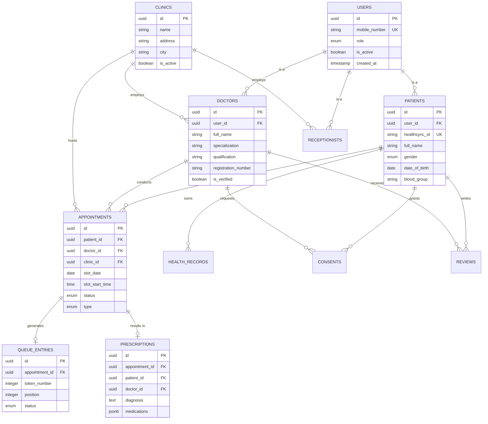

# Unified Database Schema Reference

**Document:** 09_database_schema.md
**Status:** Draft
**Version:** 1.0

---

## 1. Overview

This document provides a consolidated Entity Relationship Diagram (ERD) and relational schema specification for the PostgreSQL database powering the HealthSync platform.

---

## 2. Entity Relationship Diagram (ERD)

---

## 3. Core Tables Summary

1. `users`: Base authentication table storing credentials, roles, and status.
2. `patients`: Detailed profile linked to `users`, holding the unique `healthsync_id`.
3. `doctors`: Medical credentials, specializations, and verification status.
4. `clinics`: Healthcare facility records and addresses.
5. `appointments`: Central table tracking slots, statuses, and scheduling type (`SCHEDULED` vs `WALK_IN`).
6. `queue_entries`: Daily sequential tokens and live queue progression.
7. `prescriptions`: Formatted digital prescription data with JSONB medication lists.
8. `consents`: Medical record access authorizations and auto-expiry timestamps.
9. `audit_logs`: Immutable security audit trails for all critical operations.
